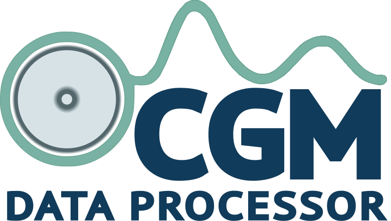
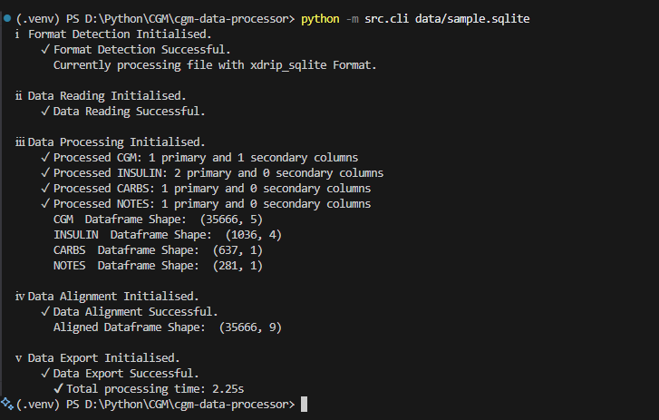

 
 
 
 
 
[](https://github.com/Warren8824/cgm-data-processor/actions/workflows/tests.yml) 
 
[](https://opensource.org/licenses/MIT)

> ⚠️ **Medical Disclaimer**: This is a data analysis and learning tool only. It is not a medical device and should not be used for clinical decision-making.

**CGM Data Processor** is a personal project to explore parsing, normalising, and exporting diabetes device data (CGM, insulin, carbs, notes). It enables consistent local data storage across different device formats, supporting learning and experimentation in Python, data engineering, and research workflows.

---

📚 **[Full Documentation](https://warren8824.github.io/cgm-data-processor/)** | 🐛 **[Report Issues](https://github.com/Warren8824/cgm-data-processor/issues)** | 💬 **[Discussions](https://github.com/Warren8824/cgm-data-processor/discussions)**

## Why This Exists

As someone living with Type 1 diabetes, I have experienced the frustration when device updates break access to historical data exports. This project is designed to:

- Preserve personal historical diabetes data in a standardised format  
- Enable exploration and analysis across different device formats  
- Provide complete control over personal data without vendor lock-in  
- Serve as a learning platform for Python, data processing, and structured dataset handling

> Note: While it could be adapted for research or multi-user analysis, current use is strictly personal and exploratory.



---

## Supported Devices

- ✅ **XDrip+** SQLite exports  
- ✅ **LibreView** CSV exports  
- 🚧 Additional device formats in development

### Contributing Learning Formats

Contributions are welcome for **learning purposes**:

1. Open an issue describing the device or app and export format  
2. Provide sample files with **dummy data only**  
3. Follow the [Contributing Guide](https://warren8824.github.io/cgm-data-processor/contributing/formats/) for creating new format definitions

---

## Quick Start

### Installation

#### Using Poetry (recommended)

```powershell
pip install poetry
git clone https://github.com/Warren8824/cgm-data-processor.git
cd cgm-data-processor
poetry install --with dev
pre-commit install
```

#### Using pip (quick test with sample data)

```Powershell
git clone https://github.com/Warren8824/cgm-data-processor.git
cd cgm-data-processor
pip install -r requirements.txt
python -m src.cli sample_data/sample_libreview.csv
```

### Basic Usage

```Powershell
python -m src.cli sample_data/sample_libreview.csv
```

#### Key CLI Options

```Powershell
--debug                     # Enable debug logging
--output PATH               # Output folder (default: data/exports)
--interpolation-limit INT   # Max CGM gaps to interpolate (4 = 20 minutes)
--bolus-limit FLOAT         # Max insulin units for bolus classification
--max-dose FLOAT            # Maximum valid insulin dose threshold
```

## What You Get

Each processing run produces a self-contained folder under data/exports/:

```
data/exports/
└── 2023-06-03_to_2023-10-05_complete_20251004T194625/
    ├── cgm.csv
    ├── insulin.csv
    ├── carbs.csv
    ├── notes.csv
    ├── aligned_data.csv
    ├── processing_notes.json
    └── monthly/
        ├── 2023-06/cgm.csv
        └── ...
```

## Use Cases (Exploratory / Learning)

- Personal data exploration and retrospective analysis
- Evaluating CGM data completeness and identifying gaps
- Converting exports between devices for personal study
- Experimenting with data alignment, processing pipelines, and Python workflows
- Preparing personal datasets for visualisation and analysis

Not intended for clinical or research use beyond personal experimentation.

## Project Architecture

```
src/
├── cli.py                          # Entry point
├── file_parser/
│   └── format_detector.py          # Validates file structure
├── core/
│   ├── format_registry.py          # Dynamic format loading
│   ├── devices/                    # Device format definitions
│   │   ├── xdrip/
│   │   ├── libreview/
│   └── aligner.py                  # Timeline alignment
├── readers/                        # CSV/SQLite readers
├── processors/                     # CGM, insulin, carbs, notes processing
└── exporters/                       # CSV export and metadata writer
```

### Data Flow

```Mermaid
flowchart LR
    A[Device Export] --> B[Format Detector]
    B --> C[Reader]
    C --> D[Processor]
    D --> E[Aligner]
    E --> F[Exporter]
    F --> G[CSV + JSON Outputs]
```

## Development & Testing

### Prerequisites

- Python 3.10+
- Poetry (recommended) or pip + venv

### Code Quality

- Black — formatting
- isort — import sorting
- Pylint — static analysis
- pytest — tests
- codespell — typo checking
- Pre-commit hooks — automated checks

```Powershell
# Activate environment (Windows)
.\.venv\Scripts\Activate.ps1
pre-commit run --all-files
pytest -q
```

## Dependencies

- numpy ≥2.1.0
- pandas ≥2.2.0
- SQLAlchemy ≥2.0.0
- plotly ≥5.0.0
- MkDocs Material + MkDocstrings for documentation

## Status

- Pre-release (80% test coverage)
- Focused on personal learning and exploratory use
- PyPI release planned as a learning exercise
- Core device formats complete, additional formats in progress

## Licence
MIT Licence — see LICENSE file.

## Contact
**Warren Bebbington**
📧 warrenbebbington88@gmail.com
💬 Open an issue for questions or sample files (dummy data only)