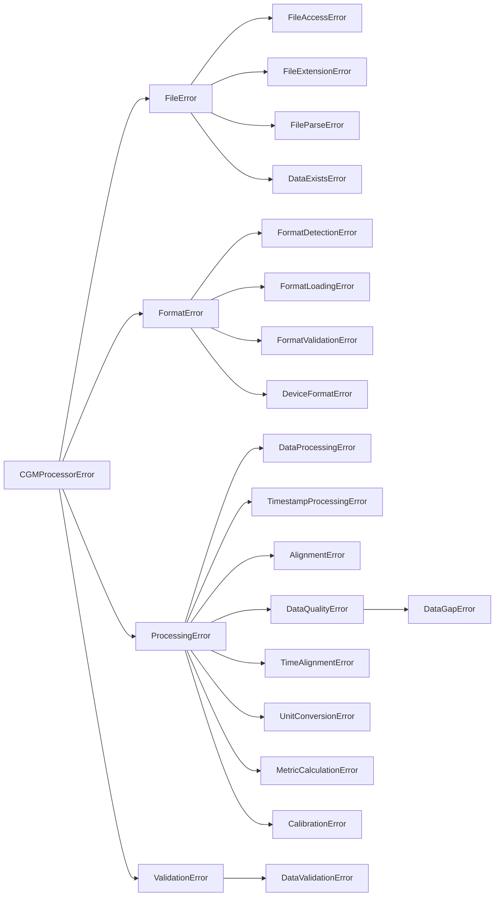

# Exceptions API Reference

The CGM Data Processor uses a hierarchical exception system to provide detailed error information. All exceptions include both an error message and optional details dictionary.

## Exception Hierarchy



## Base Exception

=== "Definition"

    ```python
    class CGMProcessorError(Exception):
        """Base exception for all CGM processor errors."""
        
        def __init__(self, message: str, details: Optional[Dict[str, Any]] = None):
            super().__init__(message)
            self.details = details or {}
    ```

=== "Usage"

    ```python
    try:
        raise CGMProcessorError(
            "Processing failed",
            details={
                "step": "validation",
                "reason": "missing data"
            }
        )
    except CGMProcessorError as e:
        print(f"Error: {str(e)}")
        print(f"Details: {e.details}")
    ```

## File-Related Exceptions


All file-related exceptions inherit from `FileError`

=== "FileAccessError"
    Raised when there's an error accessing a file.
    ```python
    try:
        with open(path) as f:
            data = f.read()
    except OSError as e:
        raise FileAccessError(
            f"Cannot access file: {path}",
            details={"error": str(e)}
        )
    ```

=== "FileExtensionError"
    Raised when a file extension is not supported.
    ```python
    if not path.suffix.lower() in ['.csv', '.sqlite', '.xml']:
        raise FileExtensionError(
            f"Unsupported file type: {path.suffix}",
            details={"supported_types": ['.csv', '.sqlite', '.xml']}
        )
    ```

=== "FileParseError"
    Raised when there's an error parsing file contents.
    ```python
    try:
        df = pd.read_csv(path)
    except pd.errors.ParserError as e:
        raise FileParseError(
            "Failed to parse CSV file",
            details={"error": str(e)}
        )
    ```

=== "DataExistsError"
    Raised when the reader returns no data.
    ```python
    if df.empty:
        raise DataExistsError(
            "No data found in file",
            details={"file": str(path)}
        )
    ```

## Format-Related Exceptions

All format-related exceptions inherit from `FormatError`

=== "FormatDetectionError"
    Raised when there's an error detecting file format.
    ```python
    if not matching_formats:
        raise FormatDetectionError(
            "No matching format found",
            details={"attempted_formats": attempted}
        )
    ```

=== "FormatLoadingError"
    Raised when a format file can't be loaded.
    ```python
    try:
        module = importlib.import_module(format_path)
    except ImportError as e:
        raise FormatLoadingError(
            f"Failed to load format: {format_name}",
            details={"error": str(e)}
        )
    ```

=== "FormatValidationError"
    Raised when there's an error validating format definition.
    ```python
    if not format_def.files:
        raise FormatValidationError(
            "Format must define at least one file",
            details={"format_name": format_def.name}
        )
    ```

=== "DeviceFormatError"
    Raised for device-specific format issues.
    ```python
    if not device_config.valid():
        raise DeviceFormatError(
            f"Invalid device configuration: {device}",
            details={"issues": validation_errors}
        )
    ```

## Processing Exceptions

Processing errors cover data handling, calculation, and quality issues

=== "Data Processing"
    ```python
    class DataProcessingError(ProcessingError):
        """Raised when there's an error processing data."""

    class TimestampProcessingError(ProcessingError):
        """Raised when there are timestamp format issues."""

    class AlignmentError(ProcessingError):
        """Raised when there is an error aligning datasets."""
    ```

=== "Data Quality"
    ```python
    class DataQualityError(ProcessingError):
        """Raised when data quality checks fail."""

    class DataGapError(DataQualityError):
        """Raised when data gaps exceed thresholds."""

    class CalibrationError(ProcessingError):
        """Raised for sensor calibration issues."""
    ```

=== "Calculations"
    ```python
    class UnitConversionError(ProcessingError):
        """Raised for unit conversion issues."""

    class MetricCalculationError(ProcessingError):
        """Raised when calculating diabetes metrics."""

    class TimeAlignmentError(ProcessingError):
        """Raised when aligning data streams."""
    ```

## Validation Exceptions

```python
class ValidationError(CGMProcessorError):
    """Base class for validation errors."""

class DataValidationError(ValidationError):
    """Raised when there's an error validating data."""
```

## Example Usage

```python
try:
    # Attempt to process file
    processor.process_file(file_path)

except FileAccessError as e:
    logger.error("Cannot access file: %s", e.details.get('path'))
    raise

except FormatDetectionError as e:
    logger.error(
        "Format detection failed. Attempted formats: %s",
        e.details.get('attempted_formats')
    )
    raise

except DataQualityError as e:
    logger.warning(
        "Data quality issues detected: %s",
        e.details.get('quality_metrics')
    )
    # Handle quality issues...

except CGMProcessorError as e:
    # Catch any other processor errors
    logger.error("Processing error: %s Details: %s", str(e), e.details)
    raise
```

## Best Practices

!!! tip "Exception Handling Tips"
    1. **Use Specific Exceptions**
        - Catch the most specific exception possible
        - Provide detailed error messages
        - Include relevant details in the details dictionary

    2. **Error Details**
        - Include file paths when relevant
        - Add validation error specifics
        - Include attempted operations
        - Reference related data

    3. **Exception Chaining**
        - Use `raise ... from e` to preserve stack traces
        - Chain exceptions when converting from other types
        - Maintain error context

    4. **Error Recovery**
        - Handle expected errors at appropriate levels
        - Log errors with appropriate severity
        - Provide user-friendly error messages