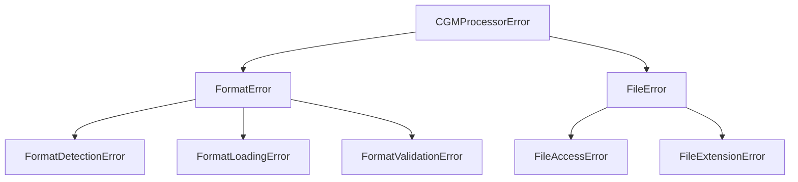

# Format Registry API Reference

The Format Registry system provides dynamic loading and management of diabetes device data formats. It consists of two main components that work together to handle format management and detection.

## Core Components

=== "FormatRegistry"

    The `FormatRegistry` manages the loading and access of device format definitions.

    ```python
    from src.file_parser.format_registry import FormatRegistry

    registry = FormatRegistry()
    formats = registry.formats  # Get all available formats
    ```

=== "FormatDetector"

    The `FormatDetector` validates files against the registered formats.

    ```python
    from src.file_parser.format_detector import FormatDetector

    detector = FormatDetector(registry)
    format, error, results = detector.detect_format(Path("data.sqlite"))
    ```

## Format Registry API

### Format Access Methods


The registry provides several methods to access and filter formats:

```python
# Get all registered formats
formats: List[DeviceFormat] = registry.formats

# Get a specific format by name
format: Optional[DeviceFormat] = registry.get_format("xdrip_sqlite")

# Get formats by file type
sqlite_formats = registry.get_formats_by_type(FileType.SQLITE)

# Get formats containing specific data type
cgm_formats = registry.get_formats_with_data_type(DataType.CGM)

# Get formats that could handle a specific file
file_formats = registry.get_formats_for_file(Path("data.sqlite"))

# Get all available data types
data_types = registry.get_available_data_types()
```

### Format Loading Process

???+ example "Dynamic Format Loading"
    The registry automatically loads formats from the devices directory:

    ```python
    def _load_formats(self) -> None:
        manufacturers_dir = Path(__file__).parent / "devices"
        if not manufacturers_dir.exists():
            raise FileAccessError(
                "Manufacturers directory not found",
                details={"directory": str(manufacturers_dir)},
            )

        # Recursively find all Python files
        for format_file in manufacturers_dir.rglob("*.py"):
            if format_file.stem == "__init__":
                continue

            try:
                self._load_format_file(format_file)
            except FormatLoadingError as e:
                logger.error(
                    "Error loading format file: %s Details: %s",
                    str(e),
                    e.details
                )
    ```

## Format Detector API

### File Type Validators

=== "SQLite"
    ```python
    def _validate_sqlite(self, path: Path, config, val_result: ValidationResult) -> bool:
        """Validate SQLite file structure."""
        try:
            engine = create_engine(f"sqlite:///{path}")
            inspector = inspect(engine)

            # Get all tables (case sensitive)
            actual_tables = {name: name for name in inspector.get_table_names()}

            # Check each required table
            for required_table in config.tables:
                table_name = required_table.name
                if table_name not in actual_tables:
                    val_result.missing_tables.append(required_table.name)
                    continue

                # Check columns
                columns = inspector.get_columns(table_name)
                column_names = {col["name"] for col in columns}

                # Check required columns exist in file
                required_columns = {
                    col.source_name
                    for col in required_table.columns
                    if col.requirement != ColumnRequirement.OPTIONAL
                }
                missing = required_columns - column_names
                if missing:
                    val_result.missing_columns[required_table.name] = [
                        col.source_name
                        for col in required_table.columns
                        if col.requirement != ColumnRequirement.OPTIONAL
                        and col.source_name in missing
                    ]

            return not val_result.has_errors()

        except FormatValidationError as e:
            logger.debug("SQLite validation error: %s", str(e))
            return False
    ```

=== "CSV"
    ```python
    def _validate_csv(self, path: Path, config, val_result: ValidationResult) -> bool:
        """Validate CSV file structure."""
        try:
            # Read CSV headers only
            df = pd.read_csv(path, nrows=0)
            columns = {col.lower() for col in df.columns}

            # CSV should have exactly one table
            csv_table = config.tables[0]

            # Check required columns
            required_columns = {
                col.source_name.lower() for col in csv_table.columns if col.required
            }
            missing = required_columns - columns
            if missing:
                val_result.missing_columns[""] = [
                    col
                    for col in csv_table.columns
                    if col.required and col.source_name.lower() in missing
                ]

            return not val_result.has_errors()

        except FormatValidationError as e:
            logger.debug("CSV validation error: %s", str(e))
            return False
    ```

=== "JSON"
    ```python
    def _validate_json(self, path: Path, config, val_result: ValidationResult) -> bool:
        """Validate JSON file structure."""
        try:
            with open(path, encoding="utf-8") as f:
                data = json.load(f)

            for json_table in config.tables:
                if isinstance(data, list):
                    if not data:
                        val_result.missing_tables.append(json_table.name)
                        continue
                    record = data[0]
                else:
                    if json_table.name not in data:
                        val_result.missing_tables.append(json_table.name)
                        continue
                    record = (
                        data[json_table.name][0]
                        if isinstance(data[json_table.name], list)
                        else data[json_table.name]
                    )

                # Check required fields
                fields = {k.lower() for k in record.keys()}
                required_fields = {
                    col.source_name.lower()
                    for col in json_table.columns
                    if col.required
                }
                missing = required_fields - fields
                if missing:
                    val_result.missing_columns[json_table.name] = [
                        col
                        for col in json_table.columns
                        if col.required and col.source_name.lower() in missing
                    ]

            return not val_result.has_errors()

        except FormatValidationError as e:
            logger.debug("JSON validation error: %s", str(e))
            return False
    ```

=== "XML"
    ```python
    def _validate_xml(self, path: Path, config, val_result: ValidationResult) -> bool:
        """Validate XML file structure."""
        try:
            tree = ET.parse(path)
            root = tree.getroot()

            for xml_table in config.tables:
                elements = root.findall(f".//{xml_table.name}")
                if not elements:
                    val_result.missing_tables.append(xml_table.name)
                    continue

                # Check first element
                element = elements[0]
                fields = set()
                fields.update(element.attrib.keys())
                fields.update(child.tag for child in element)
                fields = {f.lower() for f in fields}

                required_fields = {
                    col.source_name.lower() 
                    for col in xml_table.columns 
                    if col.required
                }
                missing = required_fields - fields
                if missing:
                    val_result.missing_columns[xml_table.name] = [
                        col
                        for col in xml_table.columns
                        if col.required and col.source_name.lower() in missing
                    ]

            return not val_result.has_errors()

        except FormatValidationError as e:
            logger.debug("XML validation error: %s", str(e))
            return False
    ```

### Validation Results

!!! info "ValidationResult Class"
    ```python
    class ValidationResult:
        """Container for structure validation results."""

        def __init__(self):
            self.missing_tables: List[str] = []
            self.missing_columns: Dict[str, List[str]] = {}  # table: [columns]

        def has_errors(self) -> bool:
            """Check if any validation errors exist."""
            return bool(self.missing_tables or self.missing_columns)

        def __str__(self) -> str:
            """Format validation errors as string."""
            errors = []
            if self.missing_tables:
                errors.append(f"Missing tables: {', '.join(self.missing_tables)}")
            if self.missing_columns:
                for table, columns in self.missing_columns.items():
                    errors.append(
                        f"Missing required columns in {table}: {', '.join(columns)}"
                    )
            return "\n".join(errors)
    ```

## Usage Examples

### Basic Format Discovery

???+ example "Format Detection Example"
    ```python
    from pathlib import Path
    from src.file_parser.format_registry import FormatRegistry
    from src.file_parser.format_detector import FormatDetector

    # Initialize components
    registry = FormatRegistry()
    detector = FormatDetector(registry)

    # Detect format of a file
    file_path = Path("data.sqlite")
    format, error, results = detector.detect_format(file_path)

    if format:
        print(f"Detected format: {format.name}")
        # Access format details
        for file_config in format.files:
            for table in file_config.tables:
                print(f"Table: {table.name}")
    else:
        print(f"Detection failed: {error}")
        # Print validation results
        for format_name, result in results.items():
            if result.has_errors():
                print(f"\nValidation failures for {format_name}:")
                print(str(result))
    ```

### Error Handling




???+ example "Error Handling Example"
    ```python
    try:
        format, error, results = detector.detect_format(file_path)
        if not format:
            for format_name, result in results.items():
                if result.has_errors():
                    print(f"Validation failures for {format_name}:")
                    print(str(result))
    except FormatError as e:
        print(f"Format error: {str(e)}")
        print(f"Details: {e.details}")
    ```

## Best Practices

!!! tip "Format Registry Usage"
    1. **Format Registration**
        - Place format definitions in the appropriate device directory
        - Use clear, unique format names
        - Include comprehensive table and column definitions

    2. **Format Detection**
        - Always handle both the format and error return values
        - Check validation results for debugging format issues
        - Use debug logging for detailed format detection information

    3. **Error Handling**
        - Catch specific exceptions for different failure modes
        - Always check validation results when format detection fails
        - Log detailed error information in debug mode

    4. **Performance**
        - Format registry loads formats once at initialization
        - Cache format detection results when processing multiple files
        - Use appropriate file type validators for different formats