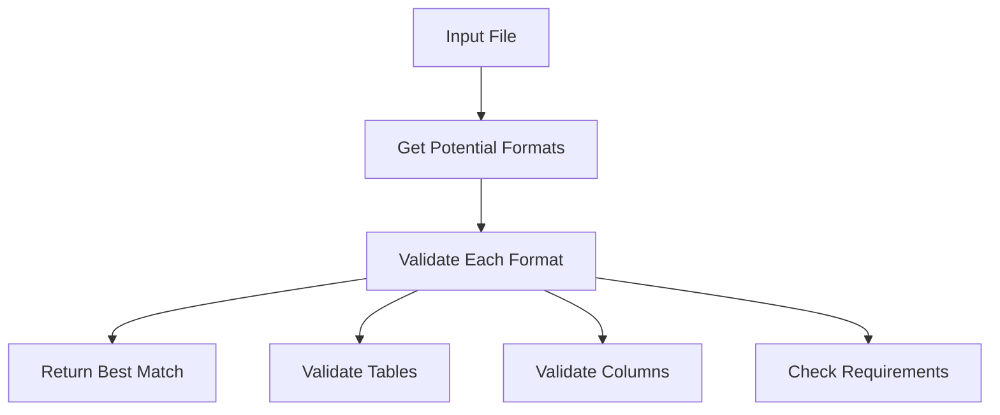

# Format Detection API Reference

The Format Detection system validates diabetes device data files against registered formats, providing detailed feedback about structure and content validation.

## Core Components

=== "FormatDetector"

    ```python
    class FormatDetector:
        """Detects device formats by examining file structure."""

        def __init__(self, format_registry: FormatRegistry):
            """Initialize detector with format registry."""
            self._registry = format_registry
    ```

=== "ValidationResult"

    ```python
    class ValidationResult:
        """Container for structure validation results."""

        def __init__(self):
            self.missing_tables: List[str] = []
            self.missing_columns: Dict[str, List[str]] = {}
    ```

## Detection Process



## Format Detection Method

=== "Method Signature"

    ```python
    def detect_format(
        self, path: Path
    ) -> Tuple[Optional[DeviceFormat], Optional[str], Dict[str, ValidationResult]]:
        """Detect format of provided file.

        Returns:
            Tuple containing:
                - Matched format (or None)
                - Error message (or None)
                - Dictionary of validation results per format tried
        """
    ```

=== "Example Usage"

    ```python
    detector = FormatDetector(registry)
    format, error, results = detector.detect_format(Path("data.sqlite"))
    
    if format:
        print(f"Detected format: {format.name}")
    else:
        print(f"Detection failed: {error}")
        for format_name, result in results.items():
            if result.has_errors():
                print(f"Validation failures for {format_name}:")
                print(str(result))
    ```

## File Type Validators

The detector includes specialized validators for each supported file type:

=== "SQLite"

    ```python
    def _validate_sqlite(self, path: Path, config, val_result: ValidationResult) -> bool:
        """Validate SQLite file structure."""
        try:
            engine = create_engine(f"sqlite:///{path}")
            inspector = inspect(engine)
            actual_tables = {name: name for name in inspector.get_table_names()}

            # Check each required table
            for required_table in config.tables:
                if required_table.name not in actual_tables:
                    val_result.missing_tables.append(required_table.name)
                    continue

                # Check columns
                columns = inspector.get_columns(required_table.name)
                column_names = {col["name"] for col in columns}
                self._validate_columns(required_table, column_names, val_result)

            return not val_result.has_errors()
        except Exception as e:
            logger.debug("SQLite validation error: %s", str(e))
            return False
    ```

=== "CSV"

    ```python
    def _validate_csv(self, path: Path, config, val_result: ValidationResult) -> bool:
        """Validate CSV file structure."""
        try:
            df = pd.read_csv(path, nrows=0)
            columns = {col.lower() for col in df.columns}

            # CSV should have exactly one table
            csv_table = config.tables[0]
            required_columns = {
                col.source_name.lower() 
                for col in csv_table.columns 
                if col.required
            }
            
            missing = required_columns - columns
            if missing:
                val_result.missing_columns[""] = list(missing)

            return not val_result.has_errors()
        except Exception as e:
            logger.debug("CSV validation error: %s", str(e))
            return False
    ```

=== "XML"

    ```python
    def _validate_xml(self, path: Path, config, val_result: ValidationResult) -> bool:
        """Validate XML file structure."""
        try:
            tree = ET.parse(path)
            root = tree.getroot()

            for xml_table in config.tables:
                elements = root.findall(f".//{xml_table.name}")
                if not elements:
                    val_result.missing_tables.append(xml_table.name)
                    continue

                # Check first element structure
                element = elements[0]
                fields = set()
                fields.update(element.attrib.keys())
                fields.update(child.tag for child in element)
                fields = {f.lower() for f in fields}
                
                self._validate_columns(xml_table, fields, val_result)

            return not val_result.has_errors()
        except Exception as e:
            logger.debug("XML validation error: %s", str(e))
            return False
    ```

## Validation Process

### Structure Validation

!!! info "Validation Steps"
    1. File existence and accessibility
    2. File type match (extension)
    3. Required tables presence
    4. Required columns presence
    5. Column data requirements

### Validation Results

The `ValidationResult` class tracks validation issues:

```python
class ValidationResult:
    def has_errors(self) -> bool:
        """Check if any validation errors exist."""
        return bool(self.missing_tables or self.missing_columns)

    def __str__(self) -> str:
        """Format validation errors as string."""
        errors = []
        if self.missing_tables:
            errors.append(f"Missing tables: {', '.join(self.missing_tables)}")
        if self.missing_columns:
            for table, columns in self.missing_columns.items():
                errors.append(
                    f"Missing required columns in {table}: {', '.join(columns)}"
                )
        return "\n".join(errors)
```

## Usage Examples

### Basic Format Detection

```python
from pathlib import Path
from src.file_parser.format_registry import FormatRegistry
from src.file_parser.format_detector import FormatDetector

# Initialize components
registry = FormatRegistry()
detector = FormatDetector(registry)

# Detect format
file_path = Path("data.sqlite")
format, error, results = detector.detect_format(file_path)

if format:
    print(f"Detected format: {format.name}")
    print("Available data types:")
    for file_config in format.files:
        for table in file_config.tables:
            print(f"  Table: {table.name}")
            for col in table.columns:
                if col.data_type:
                    print(f"    Column: {col.source_name} ({col.data_type.name})")
```

### Error Handling

```python
try:
    format, error, results = detector.detect_format(file_path)
    if not format:
        print(f"No matching format: {error}")
        # Print validation results
        for format_name, result in results.items():
            if result.has_errors():
                print(f"\nValidation failures for {format_name}:")
                if result.missing_tables:
                    print("Missing tables:", ", ".join(result.missing_tables))
                for table, cols in result.missing_columns.items():
                    print(f"Missing columns in {table}:", ", ".join(cols))
except FormatError as e:
    print(f"Format error: {str(e)}")
    print(f"Details: {e.details}")
```

## Best Practices

!!! tip "Format Detection Tips"
    1. **Format Definition**
        - Define clear validation requirements
        - Specify required vs optional columns
        - Document expected data structures

    2. **Validation Strategy**
        - Check structure before content
        - Provide detailed validation feedback
        - Handle edge cases gracefully

    3. **Error Handling**
        - Use specific error types
        - Include context in error messages
        - Log validation failures appropriately

## Common Issues

1. **Missing Tables**
    - Database tables not found
    - XML elements missing
    - Wrong file structure

2. **Column Requirements**
    - Required columns missing
    - Wrong column names
    - Case sensitivity issues

3. **Data Access**
    - File permissions
    - Corrupted files
    - Invalid file formats