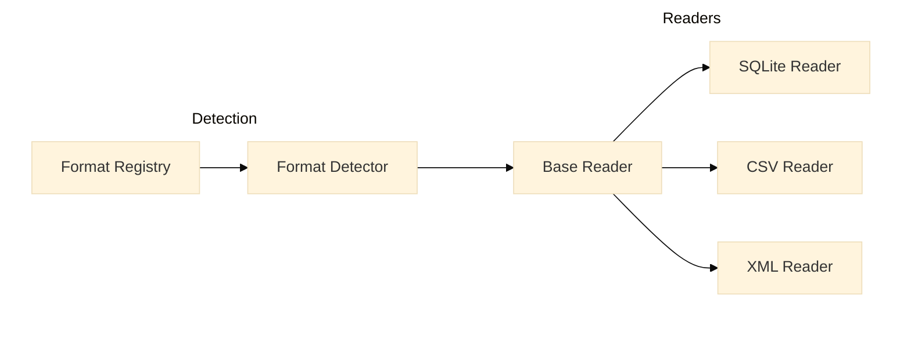

# File Parsing Overview

The File Parsing system provides a flexible and extensible framework for reading and processing diabetes device data files. It consists of three main components that work together to handle various file formats and data structures.

## Architecture Overview



## Core Components

=== "Format Registry"

    Manages device format definitions and provides format discovery:
    ```python
    registry = FormatRegistry()
    formats = registry.formats
    sqlite_formats = registry.get_formats_by_type(FileType.SQLITE)
    ```

=== "Format Detector"

    Validates files against registered formats:
    ```python
    detector = FormatDetector(registry)
    format, error, results = detector.detect_format(file_path)
    ```

=== "Reader System"

    Provides file type-specific data reading capabilities:
    ```python
    reader = BaseReader.get_reader_for_format(detected_format, file_path)
    with reader:
        table_data = reader.read_all_tables()
    ```

## Data Flow

1. **Format Detection**
    - Registry provides format definitions
    - Detector validates file structure
    - Returns matched format or error details

2. **Reader Selection**
    - Automatic reader selection based on file type
    - Resource management via context manager
    - Type-specific data reading

3. **Data Processing**
    - Table structure validation
    - Timestamp processing
    - Data validation and cleanup

## Supported File Types

!!! info "File Type Support"
    The system currently supports:

    - **SQLite**: Database files with multiple tables
    - **CSV**: Single table per file
    - **XML**: Multiple tables via XPath queries

## Common Features

### 1. Timestamp Handling

All readers provide consistent timestamp processing:

```python
def _convert_timestamp_to_utc(
    self, df: pd.DataFrame, timestamp_column: str
) -> Tuple[pd.DataFrame, TimestampType]:
    """Convert timestamp column to UTC datetime and set as index."""
```

### 2. Data Validation

Consistent validation across readers:

```python
def _validate_required_data(
    self, df: pd.DataFrame, columns: List[ColumnMapping]
) -> List[str]:
    """Check for missing data in required columns."""
```

### 3. Resource Management

All readers implement proper cleanup:

```python
def __enter__(self):
    """Context manager entry."""
    return self

def __exit__(self, exc_type, exc_val, exc_tb):
    """Cleanup resources if needed."""
    self._cleanup()
```

## Usage Example

```python
# Initialize components
registry = FormatRegistry()
detector = FormatDetector(registry)

# Detect format
format, error, results = detector.detect_format(file_path)
if format:
    # Get appropriate reader
    reader = BaseReader.get_reader_for_format(format, file_path)
    
    # Process data
    with reader:
        table_data = reader.read_all_tables()
        
        # Access processed data
        for name, data in table_data.items():
            print(f"Table: {name}")
            print(f"Shape: {data.dataframe.shape}")
```

## Error Handling

=== "Format Errors"

    ```python
    try:
        format, error, results = detector.detect_format(file_path)
        if not format:
            print(f"Detection failed: {error}")
            for format_name, result in results.items():
                if result.has_errors():
                    print(f"Validation failures for {format_name}:")
                    print(str(result))
    except FormatError as e:
        print(f"Format error: {e}")
    ```

=== "Reader Errors"

    ```python
    try:
        with reader:
            table_data = reader.read_all_tables()
    except (DataProcessingError, ReaderError) as e:
        print(f"Reading error: {e}")
    ```

## Best Practices

!!! tip "Implementation Guidelines"
    1. **Format Definition**
        - Define clear table structures
        - Specify required columns
        - Document timestamp formats

    2. **Reader Implementation**
        - Handle resource cleanup
        - Validate data integrity
        - Process timestamps consistently

    3. **Error Handling**
        - Use specific error types
        - Provide detailed error messages
        - Clean up resources on error

## Next Steps

Explore detailed documentation for each component:

- [Format Detection](format-detection.md) - Format validation and detection
- [Readers](readers.md) - File type-specific reader implementations
- [Format Registry](../core/format-registry.md) - Format management system