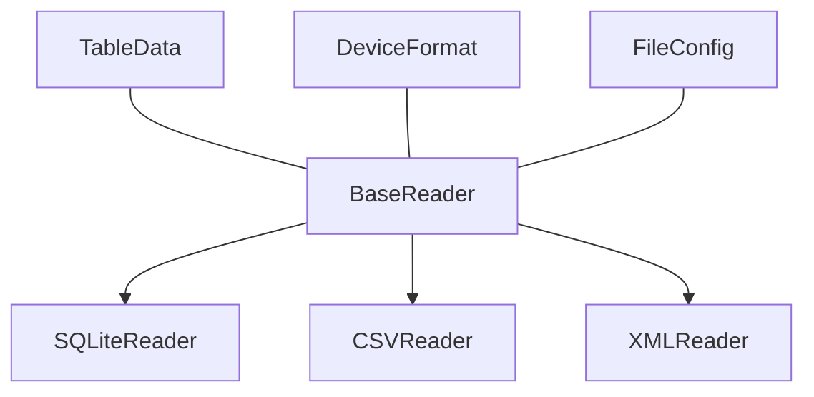

# Readers API Reference

The Readers system provides a flexible framework for reading diabetes device data from various file formats. It uses an abstract base class with concrete implementations for each supported file type.

## Architecture



## Core Components

### Reader Base Class

=== "Base Definition"

    ```python
    class BaseReader(ABC):
        """Abstract base class for all file format readers."""
        _readers: Dict[FileType, Type["BaseReader"]] = {}

        @abstractmethod
        def read_table(self, table_structure: TableStructure) -> Optional[TableData]:
            """Read and process a single table according to its structure."""
    ```

=== "Registration System"

    ```python
    @classmethod
    def register(cls, file_type: FileType):
        """Register a reader class for a specific file type."""
        def wrapper(reader_cls):
            cls._readers[file_type] = reader_cls
            return reader_cls
        return wrapper
    ```

### Table Data Container

```python
@dataclass
class TableData:
    """Holds processed data for a single table."""
    name: str
    dataframe: pd.DataFrame
    missing_required_columns: List[str]
    timestamp_type: Optional[TimestampType] = None
```

## Reader Implementations

### SQLite Reader

=== "Class Definition"

    ```python
    @BaseReader.register(FileType.SQLITE)
    class SQLiteReader(BaseReader):
        """Reads and processes SQLite files."""
        def __init__(self, path: Path, file_config: FileConfig):
            super().__init__(path, file_config)
            self._engine = None

        @property
        def engine(self):
            """Lazy initialization of database engine."""
            if self._engine is None:
                self._engine = create_engine(f"sqlite:///{self.file_path}")
            return self._engine
    ```

=== "Table Reading"

    ```python
    def read_table(self, table_structure: TableStructure) -> Optional[TableData]:
        """Read a single SQLite table."""
        try:
            # Validate identifiers
            if not self._validate_identifier(table_structure.name):
                raise DataValidationError(f"Invalid table name: {table_structure.name}")

            # Read needed columns
            columns_to_read = [
                col.source_name
                for col in table_structure.columns
                if col.requirement != ColumnRequirement.CONFIRMATION_ONLY
            ]
            columns_to_read.append(table_structure.timestamp_column)

            # Create and execute query
            quoted_columns = [f'"{col}"' for col in columns_to_read]
            query = text(f"""
                SELECT {', '.join(quoted_columns)}
                FROM "{table_structure.name}"
                ORDER BY "{table_structure.timestamp_column}"
            """)

            with self.engine.connect() as conn:
                df = pd.read_sql_query(query, conn)

            # Process timestamps and validate
            df, fmt = self._convert_timestamp_to_utc(df, table_structure.timestamp_column)
            missing_required = self._validate_required_data(df, table_structure.columns)

            return TableData(
                name=table_structure.name,
                dataframe=df,
                missing_required_columns=missing_required,
                timestamp_type=fmt,
            )
        except Exception as e:
            logger.error("Error reading SQLite table: %s", str(e))
            return None
    ```

### CSV Reader

=== "Class Definition"

    ```python
    @BaseReader.register(FileType.CSV)
    class CSVReader(BaseReader):
        """Reads and processes CSV files."""
        def __init__(self, path: Path, file_config: FileConfig):
            super().__init__(path, file_config)
            self._data = None
    ```

=== "Table Reading"

    ```python
    def read_table(self, table_structure: TableStructure) -> Optional[TableData]:
        """Read CSV file as a single table."""
        try:
            # Read data if not cached
            if self._data is None:
                self._data = pd.read_csv(
                    self.file_path,
                    encoding="utf-8",
                    low_memory=False,
                )

            # Get needed columns
            columns_to_read = [
                col.source_name
                for col in table_structure.columns
                if col.requirement != ColumnRequirement.CONFIRMATION_ONLY
            ]
            columns_to_read.append(table_structure.timestamp_column)

            # Validate and process
            df = self._data[columns_to_read].copy()
            df, fmt = self._convert_timestamp_to_utc(
                df, table_structure.timestamp_column
            )
            missing_required = self._validate_required_data(
                df, table_structure.columns
            )

            return TableData(
                name=table_structure.name,
                dataframe=df,
                missing_required_columns=missing_required,
                timestamp_type=fmt,
            )
        except Exception as e:
            logger.error("Error reading CSV: %s", str(e))
            return None
    ```

### XML Reader

=== "Class Definition"

    ```python
    @BaseReader.register(FileType.XML)
    class XMLReader(BaseReader):
        """Reads and processes XML files."""
        def __init__(self, path: Path, file_config: FileConfig):
            super().__init__(path, file_config)
            self._tree = None
            self._root = None
    ```

=== "Table Reading"

    ```python
    def read_table(self, table_structure: TableStructure) -> Optional[TableData]:
        """Read XML elements as a table."""
        try:
            self._init_xml()
            
            # Find table elements
            table_elements = self._root.findall(f".//{table_structure.name}")
            
            # Extract data
            data = {col: [] for col in columns_to_read}
            for element in table_elements:
                for column in columns_to_read:
                    value = self._extract_value(element, column)
                    data[column].append(value)

            # Convert and process
            df = pd.DataFrame(data)
            df, fmt = self._convert_timestamp_to_utc(
                df, table_structure.timestamp_column
            )
            missing_required = self._validate_required_data(
                df, table_structure.columns
            )

            return TableData(
                name=table_structure.name,
                dataframe=df,
                missing_required_columns=missing_required,
                timestamp_type=fmt,
            )
        except Exception as e:
            logger.error("Error reading XML: %s", str(e))
            return None
    ```

## Common Functionality

### Timestamp Processing

!!! info "Timestamp Handling"
    ```python
    def _convert_timestamp_to_utc(
        self, df: pd.DataFrame, timestamp_column: str
    ) -> Tuple[pd.DataFrame, TimestampType]:
        """Convert timestamp column to UTC datetime and set as index."""
        fmt = self.detect_timestamp_format(df[timestamp_column])
        
        if fmt == TimestampType.UNIX_SECONDS:
            df[timestamp_column] = pd.to_datetime(
                df[timestamp_column], unit="s", utc=True
            )
        elif fmt == TimestampType.UNIX_MILLISECONDS:
            df[timestamp_column] = pd.to_datetime(
                df[timestamp_column], unit="ms", utc=True
            )
        # ... handle other formats
        
        return df.set_index(timestamp_column).sort_index(), fmt
    ```

### Data Validation

```python
def _validate_required_data(
    self, df: pd.DataFrame, columns: List[ColumnMapping]
) -> List[str]:
    """Check for missing data in required columns."""
    missing_required = []
    for col in columns:
        if (
            col.requirement == ColumnRequirement.REQUIRED_WITH_DATA
            and col.source_name in df.columns
            and df[col.source_name].isna().all()
        ):
            missing_required.append(col.source_name)
    return missing_required
```

## Usage Examples

### Basic Reading

```python
# Get appropriate reader
reader = BaseReader.get_reader_for_format(detected_format, file_path)

# Read all tables
with reader:
    table_data = reader.read_all_tables()
    
    # Process each table
    for name, data in table_data.items():
        print(f"Table: {name}")
        print(f"Shape: {data.dataframe.shape}")
        if data.missing_required_columns:
            print("Missing columns:", data.missing_required_columns)
```

### Custom Processing

```python
# Read specific table
with reader:
    bgreadings = reader.read_table(TableStructure(
        name="BgReadings",
        timestamp_column="timestamp",
        columns=[
            ColumnMapping(
                source_name="value",
                data_type=DataType.CGM,
                unit=Unit.MGDL
            )
        ]
    ))
    
    if bgreadings:
        df = bgreadings.dataframe
        print(f"Time range: {df.index.min()} to {df.index.max()}")
```

## Best Practices

!!! tip "Implementation Guidelines"
    1. **Resource Management**
        - Use context managers properly
        - Clean up resources in `_cleanup`
        - Handle file access carefully

    2. **Data Processing**
        - Validate data early
        - Handle missing values consistently
        - Process timestamps correctly

    3. **Error Handling**
        - Use specific error types
        - Log errors appropriately
        - Clean up on errors

    4. **Performance**
        - Cache data when appropriate
        - Use efficient pandas operations
        - Handle large files carefully