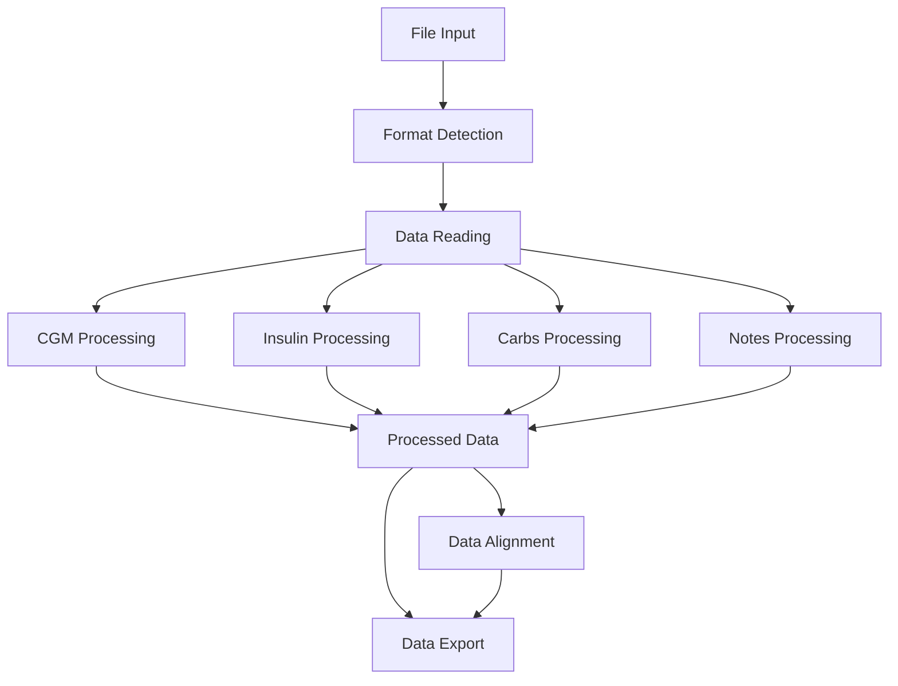

# API Reference Overview

The CGM Data Processor is built around a modular architecture that handles diabetes device data processing through distinct stages. This overview explains the core architecture, components, and data flow.

## Architecture Overview

The project is organized into several key components:



## Core Components

### 1. Data Types System
- Defines fundamental data structures through `data_types.py`
- Provides enums for supported data types:
    - Continuous Glucose Monitoring (CGM)
    - Blood Glucose Monitoring (BGM)
    - Insulin doses
    - Carbohydrate intake
    - Notes and events
- Handles unit management and data validation

### 2. Format Registry
- Manages device format definitions
- Provides format detection and validation
- Supports dynamic loading of new device formats
- Maps data sources to internal representations

### 3. Processing Pipeline
- Data reading via format-specific readers
- Type-specific data processing
- Data alignment and synchronization
- Error handling and validation

## Data Flow

1. **Format Detection**
   ```python
   from src.file_parser.format_registry import FormatRegistry
   from src.file_parser.format_detector import FormatDetector
   
   registry = FormatRegistry()
   detector = FormatDetector(registry)
   detected_format = detector.detect_format(file_path)
   ```

2. **Data Reading**
   ```python
   from src.readers.base import BaseReader
   
   reader = BaseReader.get_reader_for_format(detected_format, file_path)
   table_data = reader.read_all_tables()
   ```

3. **Data Processing**
   ```python
   from src.processors import DataProcessor
   
   processor = DataProcessor()
   processed_data = processor.process_tables(table_data, table_configs)
   ```

4. **Data Alignment**
   ```python
   from src.core.aligner import Aligner
   
   aligner = Aligner()
   aligned_data = aligner.align(processed_data)
   ```

## Error Handling

The project uses a hierarchical exception system:

```python
CGMProcessorError
├── FileError
│   ├── FileAccessError
│   ├── FileExtensionError
│   └── FileParseError
├── FormatError
│   ├── FormatDetectionError
│   ├── FormatLoadingError
│   └── FormatValidationError
├── ProcessingError
│   ├── DataProcessingError
│   ├── AlignmentError
│   └── DataQualityError
└── ValidationError
    └── DataValidationError
```

## Type Processing System

The processor system uses a registry pattern for handling different data types:

```python
from src.core.data_types import DataType
from src.processors.base import DataProcessor, BaseTypeProcessor

@DataProcessor.register_processor(DataType.CGM)
class CGMProcessor(BaseTypeProcessor):
    def process_type(self, columns: List[ColumnData]) -> ProcessedTypeData:
        # Processing implementation
        pass
```

## Key Concepts

1. **Device Formats**
   - Each device format is defined through a `DeviceFormat` class
   - Formats specify file types, table structures, and column mappings
   - Support for multiple files and tables within a format

2. **Data Type Processing**
   - Each data type has a dedicated processor
   - Processors handle unit conversion and validation
   - Support for primary and secondary data columns

3. **Data Alignment**
   - Time-based alignment of different data streams
   - Configurable alignment frequency
   - Handles missing data and gaps

4. **Validation**
   - Format validation during loading
   - Data validation during processing
   - Unit compatibility checking

## Next Steps

Explore specific components in detail:

- [Data Types Reference](core/data-types.md) - Core data structures and types
- [Format Registry](core/format-registry.md) - Format management and detection
- [Data Processing](processing/index.md) - Data processing system
- [Error Handling](core/exceptions.md) - Complete exception hierarchy