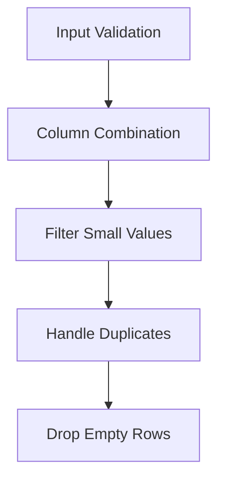

# Carbs Processor API Reference

The Carbs Processor handles carbohydrate intake data, providing validation and cleaning of carbohydrate entries from various sources.

## Processor Overview

```python
@DataProcessor.register_processor(DataType.CARBS)
class CarbsProcessor(BaseTypeProcessor):
    """Processes carbohydrate intake data with validation and cleaning."""
```

## Processing Pipeline



## Main Processing Method

=== "Method Signature"

    ```python
    def process_type(
        self,
        columns: List[ColumnData],
    ) -> ProcessedTypeData:
        """Process carbohydrate data from various sources.

        Args:
            columns: List of ColumnData containing carb data columns

        Returns:
            ProcessedTypeData containing combined and cleaned carb data
        """
    ```

=== "Example Usage"

    ```python
    processor = CarbsProcessor()
    result = processor.process_type(carb_columns)
    
    # Access processed data
    carbs_df = result.dataframe
    units = result.source_units
    notes = result.processing_notes
    ```

## Processing Steps

### 1. Input Validation

!!! info "Initial Checks"
    ```python
    # Validate primary column exists
    if not any(col.is_primary for col in columns):
        raise ProcessingError("No primary carbohydrate column found")

    # Sort columns (primary first)
    sorted_columns = sorted(columns, key=lambda x: (not x.is_primary))
    ```

### 2. Column Combination

```python
# Combine all columns with standardized names
combined_df, column_units = self._combine_and_rename_columns(
    sorted_columns, DataType.CARBS
)

if combined_df.empty:
    raise ProcessingError("No carbohydrate data to process")

# Log column information
processing_notes.append(
    f"Processing {len(combined_df.columns)} carb columns: "
    f"{', '.join(combined_df.columns)}"
)
```

### 3. Data Validation

!!! note "Value Filtering"
    ```python
    # Track original row count
    original_count = len(combined_df)

    # Process each carb column
    for col in combined_df.columns:
        # Keep only rows where carbs is >= 1.0 grams
        mask = combined_df[col] >= 1.0
        combined_df.loc[~mask, col] = None

        filtered_count = mask.sum()
        processing_notes.append(
            f"Column {col}: Kept {filtered_count} entries ≥1g "
            f"({filtered_count / original_count * 100:.1f}%)"
        )
    ```

### 4. Cleanup

=== "Drop Empty Rows"

    ```python
    # Drop rows where all values are null
    combined_df = combined_df.dropna(how="all")
    ```

=== "Handle Duplicates"

    ```python
    # Remove duplicate timestamps
    duplicates = combined_df.index.duplicated()
    if duplicates.any():
        dup_count = duplicates.sum()
        processing_notes.append(f"Removed {dup_count} duplicate timestamps")
        combined_df = combined_df[~duplicates]
    ```

## Output Format

The processor produces a `ProcessedTypeData` with:

=== "DataFrame Structure"
    - Index: 
        - DatetimeIndex
    - Columns:
        - `carbs_primary`: Primary carb entries
        - `carbs_2`, `carbs_3`, etc.: Additional columns if present
    - All values are in grams

=== "Units Dictionary"
    ```python
    {
        'carbs_primary': Unit.GRAMS,
        'carbs_2': Unit.GRAMS,
        # ... additional columns
    }
    ```

=== "Processing Notes"
    ```python
    [
        "Processing 2 carb columns: carbs_primary, carbs_2",
        "Column carbs_primary: Kept 45 entries ≥1g (90.0%)",
        "Column carbs_2: Kept 12 entries ≥1g (85.7%)",
        "Removed 2 duplicate timestamps",
        "Final dataset contains 55 entries from 60 original records"
    ]
    ```

## Validation Rules

!!! info "Data Quality Rules"
    1. **Minimum Value Rule**
        - Entries must be ≥ 1.0 grams
        - Smaller values are set to None
        - Prevents noise from tiny values

    2. **Duplicate Handling**
        - Duplicate timestamps are removed
        - First occurrence is kept
        - Duplicates are logged

    3. **Empty Data**
        - Rows with all null values are dropped
        - Empty DataFrames raise ProcessingError

## Error Handling

```python
try:
    processor = CarbsProcessor()
    result = processor.process_type(columns)
except ProcessingError as e:
    logger.error("Carbs processing failed: %s", str(e))
    # Handle error...
```

Common errors:
- No primary column
- Empty data after filtering
- Unit validation failures

## Best Practices

!!! tip "Usage Guidelines"
    1. **Data Preparation**
        - Ensure values are in grams
        - Validate timestamp index
        - Check primary column designation

    2. **Value Filtering**
        - Consider clinical significance
        - Monitor filtering ratios
        - Document unusual patterns

    3. **Performance**
        - Use vectorized operations
        - Handle large datasets efficiently
        - Monitor memory usage

## Integration Example

```python
# Process carbohydrate data
processor = CarbsProcessor()
result = processor.process_type(carb_columns)

# Access processed data
carbs_df = result.dataframe

# Calculate statistics
total_carbs = carbs_df['carbs_primary'].sum()
mean_carbs = carbs_df['carbs_primary'].mean()
entries_per_day = carbs_df.groupby(carbs_df.index.date).size()

print(f"Total Carbohydrates: {total_carbs}g")
print(f"Average per Entry: {mean_carbs:.1f}g")
print(f"Entries per Day: {entries_per_day.mean():.1f}")

# Check data quality
valid_entries = carbs_df['carbs_primary'].notna()
quality_ratio = valid_entries.sum() / len(carbs_df)
print(f"Data Quality: {quality_ratio * 100:.1f}% valid entries")
```

## Comparison with Other Processors

!!! note "Processor Characteristics"
    - **Simpler** than CGM/Insulin processors
    - **No unit conversion** needed (always grams)
    - **Binary validation** (≥1g or not)
    - **Minimal metadata** requirements