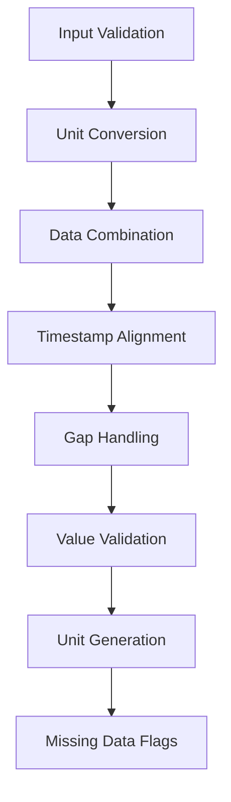

# CGM Processor API Reference

The CGM Processor handles Continuous Glucose Monitoring data, providing cleaning, interpolation, and unit conversion functionality.

## Processor Overview

```python
@DataProcessor.register_processor(DataType.CGM)
class CGMProcessor(BaseTypeProcessor):
    """Processes CGM data with validation and cleaning."""
```

## Processing Pipeline

The processor performs these operations in sequence:



## Main Processing Method

=== "Method Signature"

    ```python
    def process_type(
        self,
        columns: List[ColumnData],
        interpolation_limit: int = 4,
    ) -> ProcessedTypeData:
        """Process CGM data from various sources.

        Args:
            columns: List of ColumnData containing CGM data columns
            interpolation_limit: Maximum missing values to interpolate
                               (default: 4 = 20 minutes at 5-min intervals)

        Returns:
            ProcessedTypeData with combined and cleaned CGM data
        """
    ```

=== "Example Usage"

    ```python
    processor = CGMProcessor()
    result = processor.process_type(cgm_columns, interpolation_limit=6)
    
    # Access processed data
    cgm_df = result.dataframe
    units = result.source_units
    notes = result.processing_notes
    ```

## Processing Steps

### 1. Data Validation

!!! info "Initial Checks"
    ```python
    # Validate primary column exists
    if not any(col.is_primary for col in columns):
        raise ProcessingError("No primary CGM column found")

    # Sort columns (primary first)
    sorted_columns = sorted(columns, key=lambda x: (not x.is_primary))
    ```

### 2. Unit Conversion

!!! note "Standardization to mg/dL"
    ```python
    if col_data.unit == Unit.MMOL:
        df["value"] = df["value"] * 18.0182
        processing_notes.append(
            f"Converted CGM column {idx + 1} from {Unit.MMOL.value} to {Unit.MGDL.value}"
        )
    ```

### 3. Time Alignment

```python
# Round timestamps to 5-minute intervals
combined_df.index = combined_df.index.round("5min")

# Handle duplicate times by averaging
combined_df = combined_df.groupby(level=0).mean()

# Create complete timeline
full_index = pd.date_range(
    start=combined_df.index.min(),
    end=combined_df.index.max(),
    freq="5min"
)
```

### 4. Gap Handling

!!! warning "Gap Detection and Interpolation"
    ```python
    # Create groups of consecutive missing values
    gap_groups = (~combined_df[col].isna()).cumsum()

    # Count size of each gap
    gap_size = combined_df[combined_df[col].isna()].groupby(gap_groups).size()

    # Find large gaps (> interpolation_limit)
    large_gaps = gap_size[gap_size > interpolation_limit].index

    # Interpolate within limit
    combined_df[col] = combined_df[col].interpolate(
        method="linear",
        limit=interpolation_limit,
        limit_direction="forward",
    )

    # Reset large gaps back to NaN
    for gap_group in large_gaps:
        mask = (gap_groups == gap_group) & combined_df[col].isna()
        combined_df.loc[mask, col] = np.nan
    ```

### 5. Value Validation

```python
# Clip values to valid range (mg/dL)
combined_df[col] = combined_df[col].clip(lower=39.64, upper=360.36)
```

### 6. Unit Generation

```python
# Create mmol/L versions of each column
for col in combined_df.columns.copy():
    mmol_col = f"{col}_mmol"
    combined_df[mmol_col] = combined_df[col] * 0.0555
    column_units[mmol_col] = Unit.MMOL
    column_units[col] = Unit.MGDL
```

## Output Format

The processor produces a `ProcessedTypeData` with:

=== "DataFrame Structure"
    - Index: DatetimeIndex (5-minute intervals)
    - Columns:
        - `cgm_primary`: Primary readings (mg/dL)
        - `cgm_primary_mmol`: Primary readings (mmol/L)
        - `cgm_2`, `cgm_3`, etc.: Secondary readings if available
        - `missing`: Boolean flag for missing/interpolated values

=== "Units Dictionary"
    ```python
    {
        'cgm_primary': Unit.MGDL,
        'cgm_primary_mmol': Unit.MMOL,
        'cgm_2': Unit.MGDL,
        'cgm_2_mmol': Unit.MMOL,
        # ... additional columns
    }
    ```

=== "Processing Notes"
    ```python
    [
        "Converted CGM column 1 from mmol/L to mg/dL",
        "Processed 1440 total CGM readings",
        "Found 12 missing or interpolated values in primary data"
    ]
    ```

## Data Quality Features

1. **Interpolation Control**
    - Maximum gap interpolation: 4 readings (20 minutes)
    - Larger gaps preserved as missing data
    - Missing data tracking via flags

2. **Value Validation**
    - Valid range: 39.64 - 360.36 mg/dL
    - Out-of-range values clipped
    - Unit conversion precision maintained

3. **Time Alignment**
    - 5-minute interval standardization
    - Duplicate handling via averaging
    - Complete timeline generation

## Error Handling

```python
try:
    processor = CGMProcessor()
    result = processor.process_type(columns)
except ProcessingError as e:
    logger.error("CGM processing failed: %s", str(e))
    # Handle error...
```

Common errors:

- No primary column
- Invalid unit types
- Data validation failures
- Interpolation issues

## Best Practices

!!! tip "Usage Guidelines"
    1. **Data Preparation**
        - Ensure timestamp index
        - Validate unit specifications
        - Check primary/secondary relationships

    2. **Interpolation Settings**
        - Default (4) works for most CGM data
        - Adjust based on device characteristics
        - Consider clinical requirements

    3. **Performance**
        - Process in manageable time chunks
        - Monitor memory usage with large datasets
        - Use efficient pandas operations