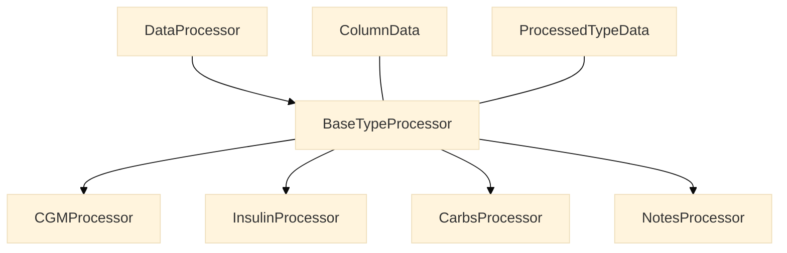

# Data Processing Overview

The Data Processing system uses a modular, type-based architecture to process different kinds of diabetes data. It provides automatic processor selection, data validation, and standardized output formats.

## Architecture Overview




## Core Components

=== "Data Structures"

    ```python
    @dataclass
    class ColumnData:
        """Holds data and metadata for a single column."""
        dataframe: pd.DataFrame  # Single column DataFrame
        unit: Unit
        config: ColumnMapping
        is_primary: bool

    @dataclass
    class ProcessedTypeData:
        """Holds processed data for a single data type."""
        dataframe: pd.DataFrame
        source_units: Dict[str, Unit]  # Maps column name to its original unit
        processing_notes: List[str]
    ```

=== "Processor Base"

    ```python
    class BaseTypeProcessor(ABC):
        """Abstract base class for type-specific processors."""
        @abstractmethod
        def process_type(self, columns: List[ColumnData]) -> ProcessedTypeData:
            """Process all data of a specific type."""
    ```

=== "Main Processor"

    ```python
    class DataProcessor:
        """Main processor class that handles all data types."""
        _type_processors: Dict[DataType, Type[BaseTypeProcessor]] = {}

        @classmethod
        def register_processor(cls, data_type: DataType):
            """Register a processor for a specific data type."""
    ```

## Type-Specific Processors

!!! info "Available Processors"
    The system includes processors for:

    1. **CGM Data**
        - Continuous glucose readings
        - Gap interpolation
        - Unit conversion

    2. **Insulin Data**
        - Dose classification (basal/bolus)
        - Metadata processing
        - Dose validation

    3. **Carbohydrate Data**
        - Intake records
        - Value validation
        - Duplicate handling

    4. **Notes Data**
        - Text processing
        - String cleaning
        - Empty value handling

## Processing Pipeline

### 1. Data Organization

```python
# Group columns by data type
for table_name, data in table_data.items():
    config = table_configs[table_name]
    
    for column in config.columns:
        if column.data_type:
            target_type = (
                DataType.INSULIN
                if column.data_type == DataType.INSULIN_META
                else column.data_type
            )
            
            df_subset = data.dataframe[[column.source_name]].copy()
            column_data = ColumnData(
                dataframe=df_subset,
                unit=column.unit,
                config=column,
                is_primary=column.is_primary,
            )
```

### 2. Processor Selection

```python
# Get appropriate processor for each type
processor = DataProcessor()
for data_type, columns in type_data.items():
    type_processor = processor.get_processor_for_type(data_type)
    result = type_processor.process_type(columns)
```

### 3. Data Processing

Each processor handles its specific data type:

=== "CGM Processing"
    - Time alignment (5-min intervals)
    - Gap interpolation
    - Unit conversion (mg/dL ↔ mmol/L)

=== "Insulin Processing"
    - Dose classification
    - Meta information extraction
    - Value validation

=== "Carbs Processing"
    - Value validation (≥1g)
    - Duplicate removal
    - Empty value handling

=== "Notes Processing"
    - Text cleaning
    - Empty string handling
    - NA value management

## Usage Examples

### Basic Processing

```python
from src.processors import DataProcessor
from src.core.data_types import DataType

# Initialize processor
processor = DataProcessor()

# Process all tables
results = processor.process_tables(table_data, table_configs)

# Access processed data by type
cgm_data = results.get(DataType.CGM)
insulin_data = results.get(DataType.INSULIN)
carbs_data = results.get(DataType.CARBS)
notes_data = results.get(DataType.NOTES)

# Check processing results
for data_type, data in results.items():
    print(f"\n{data_type.name} Processing Results:")
    print(f"Records: {len(data.dataframe)}")
    print("Notes:", "\n  ".join(data.processing_notes))
```

### Custom Processor Registration

```python
@DataProcessor.register_processor(DataType.CGM)
class CustomCGMProcessor(BaseTypeProcessor):
    def process_type(self, columns: List[ColumnData]) -> ProcessedTypeData:
        # Custom processing logic
        processed_df = self._custom_processing(columns)
        
        return ProcessedTypeData(
            dataframe=processed_df,
            source_units={"custom_col": Unit.MGDL},
            processing_notes=["Custom processing completed"]
        )
```

## Error Handling

```python
try:
    results = processor.process_tables(table_data, table_configs)
except ProcessingError as e:
    print(f"Processing error: {str(e)}")
    # Handle error...
```

Common errors:

- Missing primary columns
- Invalid unit types
- Data validation failures
- Processing errors

## Best Practices

!!! tip "Implementation Guidelines"
    1. **Type Processing**
        - Validate input data
        - Handle missing values
        - Document processing steps
        - Track data modifications

    2. **Unit Handling**
        - Validate units before processing
        - Convert to standard units
        - Track unit information
        - Document conversions

    3. **Performance**
        - Use vectorized operations
        - Handle large datasets
        - Clean up resources
        - Monitor memory usage

    4. **Error Handling**
        - Use specific exceptions
        - Provide detailed messages
        - Log processing steps
        - Clean up on errors

## Integration with Other Components

1. **Format Detection**
    - Provides validated table structures
    - Confirms data availability
    - Validates column requirements

2. **Data Alignment**
    - Uses processed results
    - Aligns multiple data types
    - Handles time synchronization

3. **Result Usage**
    - Analysis and visualization
    - Data export
    - Quality metrics
    - Report generation