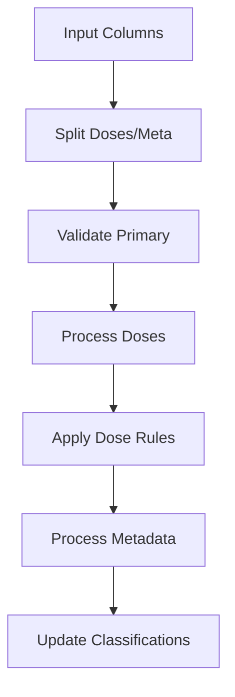

# Insulin Processor API Reference

The Insulin Processor handles insulin dose data, providing dose classification (basal/bolus) through both dose-based rules and metadata analysis.

## Processor Overview

```python
@DataProcessor.register_processor(DataType.INSULIN)
class InsulinProcessor(BaseTypeProcessor):
    """Processes insulin dose data with classification from meta data if available."""
```

## Processing Pipeline



## Main Processing Method

=== "Method Signature"

    ```python
    def process_type(
        self,
        columns: List[ColumnData],
        bolus_limit: float = 8.0,
        max_limit: float = 15.0,
    ) -> ProcessedTypeData:
        """Process insulin data and classify doses.

        Args:
            columns: List of ColumnData containing insulin data and metadata
            bolus_limit: Maximum insulin units to classify as bolus
            max_limit: Maximum valid insulin dose

        Returns:
            ProcessedTypeData with processed insulin data
        """
    ```

=== "Example Usage"

    ```python
    processor = InsulinProcessor()
    result = processor.process_type(
        insulin_columns,
        bolus_limit=10.0,  # Custom bolus limit
        max_limit=20.0     # Custom maximum dose
    )
    ```

## Processing Steps

### 1. Column Separation

!!! info "Separating Doses from Metadata"
    ```python
    # Find insulin dose and meta columns
    dose_cols = [col for col in columns if col.data_type == DataType.INSULIN]
    meta_cols = [
        col for col in columns if col.data_type == DataType.INSULIN_META
    ]

    if not any(col.is_primary for col in dose_cols):
        raise ProcessingError("No primary insulin dose column found")
    ```

### 2. Dose Processing

=== "Initial Validation"

    ```python
    # Keep only positive doses
    valid_mask = df["value"] > 0.0
    df = df[valid_mask]
    
    if len(df) > 0:
        processing_notes.append(f"Found {len(df)} positive doses")
    ```

=== "Dose Classification"

    ```python
    # Initial classification based on dose
    result_df["is_bolus"] = df["value"] <= bolus_limit
    result_df["is_basal"] = (df["value"] > bolus_limit) & (
        df["value"] <= max_limit
    )
    result_df["type"] = ""  # Will be filled by metadata
    ```

### 3. Metadata Processing

!!! note "Metadata Extraction"
    ```python
    def _extract_meta_info(self, meta_value: str) -> Tuple[bool, bool, Optional[str]]:
        """Extract insulin type information from meta JSON.

        Returns:
            Tuple of (is_bolus, is_basal, insulin_type)
        """
        try:
            meta_data = json.loads(meta_value)
            if meta_data and isinstance(meta_data, list):
                insulin = meta_data[0].get("insulin", "").lower()
                if "novorapid" in insulin:
                    return True, False, "novorapid"
                if "levemir" in insulin:
                    return False, True, "levemir"
        except (json.JSONDecodeError, IndexError, KeyError, AttributeError):
            pass

        return False, False, None
    ```

### 4. Classification Update

```python
# Update classification with metadata if available
if meta_cols and not result_df.empty:
    meta_updates = 0
    for col in meta_cols:
        for idx, meta_value in col.dataframe["value"].items():
            if idx in result_df.index:
                is_bolus, is_basal, insulin_type = self._extract_meta_info(
                    meta_value
                )
                if insulin_type:
                    result_df.loc[idx, "is_bolus"] = is_bolus
                    result_df.loc[idx, "is_basal"] = is_basal
                    result_df.loc[idx, "type"] = insulin_type
                    meta_updates += 1
```

## Output Format

The processor produces a `ProcessedTypeData` with:

=== "DataFrame Structure"
    - Index: 
        - DatetimeIndex
    - Columns:
        - `dose`: Insulin dose in units
        - `is_bolus`: Boolean flag for bolus doses
        - `is_basal`: Boolean flag for basal doses
        - `type`: String identifier for insulin type

=== "Units Dictionary"
    ```python
    {
        'dose': Unit.UNITS
    }
    ```

=== "Processing Notes"
    ```python
    [
        "Found 24 positive doses",
        "Initial dose-based classification:",
        "- 18 doses classified as bolus (≤8.0U)",
        "- 6 doses classified as basal (>8.0U)",
        "- Dropped 0 doses exceeding 15.0U",
        "Updated 12 classifications using metadata",
        "Final dataset contains 24 insulin records"
    ]
    ```

## Classification Rules

!!! info "Dose Classification Logic"
    1. **Initial Rule-Based Classification**
        - Bolus: dose ≤ bolus_limit
        - Basal: bolus_limit < dose ≤ max_limit
        - Invalid: dose > max_limit

    2. **Metadata-Based Classification**
        - "novorapid" → Bolus
        - "levemir" → Basal
        - Metadata overrides rule-based classification

    3. **Default Parameters**
        - bolus_limit = 8.0 units
        - max_limit = 15.0 units

## Error Handling

```python
try:
    processor = InsulinProcessor()
    result = processor.process_type(columns)
except ProcessingError as e:
    logger.error("Insulin processing failed: %s", str(e))
    # Handle error...
```

Common errors:

- No primary dose column
- Invalid metadata format
- Dose validation failures

## Best Practices

!!! tip "Usage Guidelines"
    1. **Data Preparation**
        - Ensure doses are in correct units
        - Validate metadata JSON format
        - Check timestamp alignment

    2. **Classification Limits**
        - Adjust based on treatment protocol
        - Consider patient-specific limits
        - Document limit changes

    3. **Metadata Handling**
        - Validate JSON structure
        - Handle missing metadata gracefully
        - Log metadata processing results

    4. **Performance**
        - Parse metadata efficiently
        - Use vectorized operations
        - Minimize row-by-row operations

## Integration Example

```python
# Process insulin data with custom limits
processor = InsulinProcessor()
result = processor.process_type(
    columns=insulin_columns,
    bolus_limit=10.0,  # Higher bolus threshold
    max_limit=20.0     # Higher maximum dose
)

# Access processed data
doses_df = result.dataframe
bolus_mask = doses_df["is_bolus"]
basal_mask = doses_df["is_basal"]

# Calculate statistics
total_bolus = doses_df.loc[bolus_mask, "dose"].sum()
total_basal = doses_df.loc[basal_mask, "dose"].sum()

print(f"Total Bolus: {total_bolus}U")
print(f"Total Basal: {total_basal}U")
```