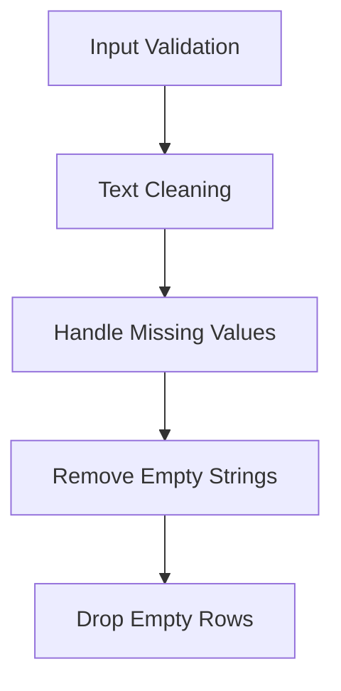

# Notes Processor API Reference

The Notes Processor handles diabetes-related text notes and comments, providing text validation and cleaning while preserving temporal relationships.

## Processor Overview

```python
@DataProcessor.register_processor(DataType.NOTES)
class NotesProcessor(BaseTypeProcessor):
    """Processes text notes/comments data."""
```

## Processing Pipeline



## Main Processing Method

=== "Method Signature"

    ```python
    def process_type(
        self,
        columns: List[ColumnData],
    ) -> ProcessedTypeData:
        """Process notes data ensuring safe string storage.

        Args:
            columns: List of ColumnData containing notes columns

        Returns:
            ProcessedTypeData containing processed notes
        """
    ```

=== "Example Usage"

    ```python
    processor = NotesProcessor()
    result = processor.process_type(notes_columns)
    
    # Access processed data
    notes_df = result.dataframe
    notes = result.processing_notes
    ```

## Processing Steps

### 1. Input Validation

!!! info "Initial Checks"
    ```python
    # Validate primary column exists
    if not any(col.is_primary for col in columns):
        raise ProcessingError("No primary notes column found")

    # Sort columns (primary first)
    sorted_columns = sorted(columns, key=lambda x: (not x.is_primary))
    ```

### 2. Text Processing

```python
# Initialize result dataframe
result_df = pd.DataFrame(index=pd.DatetimeIndex([]))

# Process each column
for idx, col_data in enumerate(sorted_columns):
    # Generate column name
    col_name = self._generate_column_name(
        DataType.NOTES, col_data.is_primary, idx
    )

    # Get the notes series
    notes_series = col_data.dataframe["value"]

    # Replace None with pd.NA
    notes_series = notes_series.replace([None], pd.NA)

    # Clean non-NA values
    notes_series = notes_series.apply(
        lambda x: x.strip() if pd.notna(x) else pd.NA
    )

    # Remove empty strings
    notes_series = notes_series.replace({"": pd.NA})
```

### 3. Data Validation

!!! note "Value Handling"
    ```python
    # Add to result DataFrame only if we have any valid notes
    if not notes_series.isna().all():
        result_df[col_name] = notes_series

        # Track stats
        valid_notes = notes_series.notna()
        processing_notes.append(
            f"Column {col_name}: found {valid_notes.sum()} valid notes"
        )
    ```

### 4. Cleanup

```python
# Drop rows where all values are NA
if not result_df.empty:
    result_df = result_df.dropna(how="all")

processing_notes.append(
    f"Final dataset contains {len(result_df)} notes entries"
)
```

## Output Format

The processor produces a `ProcessedTypeData` with:

=== "DataFrame Structure"
    - Index:
        - DatetimeIndex
    - Columns:
        - `notes_primary`: Primary notes entries
        - `notes_2`, `notes_3`, etc.: Additional columns if present
    - All values are strings or pd.NA

=== "Units Dictionary"
    ```python
    {
        # Empty dictionary - no units for text data
    }
    ```

=== "Processing Notes"
    ```python
    [
        "Column notes_primary: found 45 valid notes",
        "Column notes_2: found 12 valid notes",
        "Final dataset contains 55 notes entries"
    ]
    ```

## Text Processing Rules

!!! info "Text Handling Rules"
    1. **NULL Handling**
        - None values converted to pd.NA
        - Empty strings converted to pd.NA
        - Consistent NA representation

    2. **String Cleaning**
        - Leading/trailing whitespace removed
        - Empty strings after stripping become pd.NA
        - Original text content preserved

    3. **Row Filtering**
        - Rows with all NA values are dropped
        - At least one valid note required
        - Empty DataFrames are valid

## Error Handling

```python
try:
    processor = NotesProcessor()
    result = processor.process_type(columns)
except ProcessingError as e:
    logger.error("Notes processing failed: %s", str(e))
    # Handle error...
```

Common errors:

- No primary column
- Text encoding issues
- Memory issues with large text

## Best Practices

!!! tip "Usage Guidelines"
    1. **Data Preparation**
        - Ensure text encoding consistency
        - Validate timestamp index
        - Check primary column designation

    2. **Text Cleaning**
        - Consider additional cleaning rules
        - Monitor string lengths
        - Handle special characters

    3. **Memory Management**
        - Monitor text data size
        - Consider chunking large datasets
        - Clean up temporary objects

## Integration Example

```python
# Process notes data
processor = NotesProcessor()
result = processor.process_type(notes_columns)

# Access processed data
notes_df = result.dataframe

# Analyze notes patterns
notes_per_day = notes_df.groupby(notes_df.index.date).count()['notes_primary']
has_notes = notes_df['notes_primary'].notna()

# Print statistics
print(f"Total Notes: {has_notes.sum()}")
print(f"Average Notes per Day: {notes_per_day.mean():.1f}")

# Search notes content
def search_notes(df: pd.DataFrame, term: str) -> pd.DataFrame:
    """Search notes for specific terms."""
    mask = df['notes_primary'].str.contains(
        term, 
        case=False, 
        na=False
    )
    return df[mask]

# Example: Find exercise-related notes
exercise_notes = search_notes(notes_df, 'exercise')
print(f"Found {len(exercise_notes)} exercise-related notes")
```

## Comparison with Other Processors

!!! note "Processor Characteristics"
    - **Text-based** rather than numeric
    - **No unit handling** required
    - **Flexible validation** rules
    - **String manipulation** focus
    - **Memory intensive** with large text

## Use Cases

1. **Clinical Notes**

    - Patient observations
    - Treatment adjustments
    - Lifestyle factors

2. **Event Tracking**

    - Exercise sessions
    - Diet changes
    - Medication changes

3. **Data Analysis**

    - Pattern identification
    - Event correlation
    - Temporal analysis