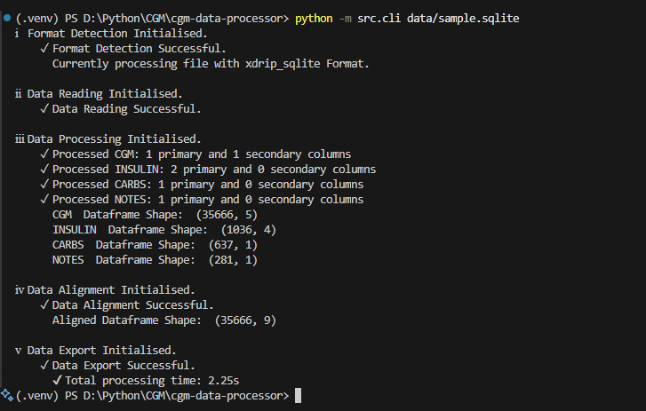
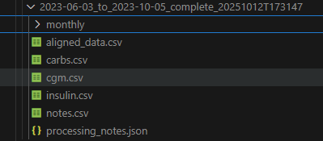

<div class="hero">
  
</div>

      [](https://opensource.org/licenses/MIT)

---

## 📍 What is CGM Data Processor?

**CGM Data Processor** is a Python-based toolkit for analysing diabetes-related data from multiple Continuous Glucose Monitoring (CGM) and treatment logging platforms, including **XDrip+** and **Freestyle Libre**.

It aims to provide a **standardised data model**, supported by **robust validation**, **gap detection**, **interpolation**, and **treatment processing**, enabling researchers, patients, and developers to gain deeper insights into glucose trends and treatment dynamics.

This project is currently in **pre-release**, actively developed with the goal of becoming a fully documented, test-covered Python package suitable for real-world data analysis workflows and professional portfolio presentation.

---

## 📈 Process Your Diabetes Data

<div class="feature-card">
  <p>
  Analyse consolidated diabetes data with confidence. Process CGM readings, insulin doses, carbohydrate intake, and treatment notes with repeatable, validated workflows designed for extensibility.
  </p>
</div>

---

## 🩸 CGM Analysis Includes
- Automatic gap detection
- Configurable interpolation
- Basic quality metrics (more planned)

---

## 💉 Treatment Data Support
- Insulin bolus and basal events
- Carbohydrate entries
- Event and annotation handling

---

## 🧪 Data Pipeline Features

- ✅ Automated file format detection  
- ✅ Cross-source alignment & merging  
- ✅ Metadata-preserving processing  
- ✅ Modular reader/processor architecture  
- ✅ Export-ready standardisation (CSV now, more to come)

---

## 🚀 Quick Start

📘 Install CGM Data Processor — see: 👉 [Installation Guide](./getting-started/installation.md)

The quickest way to run the tool during development is via the CLI entry point:

```bash
python -m src.cli data.sqlite \
    --debug                  # Display verbose output
    --interpolation-limit 6  # Max CGM gaps to fill (6 = 30 mins)
    --bolus-limit 10.0       # Max bolus insulin units
    --max-dose 20.0          # Max valid insulin dose
    --output ./my_analysis   # Output location
```

<div class="feature-card">  </div>

This produces a set of validated, aligned CSV files suitable for onward analysis, dashboarding, or importing into statistical tools.

## 🧠 Using the Library in Python

```python
from src.core.exceptions import DataProcessingError, ReaderError
from src.core.format_registry import FormatRegistry
from src.file_parser.format_detector import FormatDetector
from src.processors import DataProcessor
from src.readers import BaseReader

# Initialise format detection
registry = FormatRegistry()
detector = FormatDetector(registry)
processor = DataProcessor()
file_path = "example_data.sqlite"

# Process file
detected_format, _, _ = detector.detect_format(file_path)
reader = BaseReader.get_reader_for_format(detected_format, file_path)
with reader:
    table_data = reader.read_all_tables()
    if not table_data:
        raise ReaderError("No valid data found in file")
    try:
        processed_data = processor.process_tables(
            table_data=table_data,
            detected_format=detected_format,
        )
        if not processed_data:
            raise DataProcessingError("No data could be processed")

    except DataProcessingError as e:
        raise DataProcessingError(f"Failed to process data: {str(e)}") from e
```

More advanced configurations and workflows are covered in the 📚 [API Reference](https://warren8824.github.io/cgm-data-processor/api/core/data-types)

---

## 📊 Example Output Structure

<div class="feature-card">  </div>

---

## 🛠️ Roadmap to v1.0

|Stage	|Target	|Status|
--------|-------|-------
|✅ Base architecture |Readers, processors, CLI |Available
|✅ CLI early usage |Manual run from src root |Available
|✅ Exports | CSV currently supported | Available
|🔄 Test coverage |≥ 75% |Ongoing
|🔜 Summary statistics module| Glucose metrics & treatment breakdowns |Pending
|🔜 Visual insights| Time-series trends & stability graphs |Pending
|📦 v1 release |Published package + documentation |Planned

---

## 🤝 Contributing

Contributions, feedback, and ideas are welcome — especially around:

- Reader support for new formats

- Statistical metrics

- Visual analytics

- Performance and robustness

- Testing improvements

(Contribution guidelines will be available prior to first release.)

---

## 🛡️ Responsible Use

<div class="feature-card"> This tool is intended for retrospective data analysis only. It is not designed for real-time monitoring or medical decision-making. Always consult healthcare professionals for clinical guidance. </div>

---

## 📄 Licence

This project is licensed under the MIT Licence — see full details here: [MIT License](https://opensource.org/licenses/MIT)
