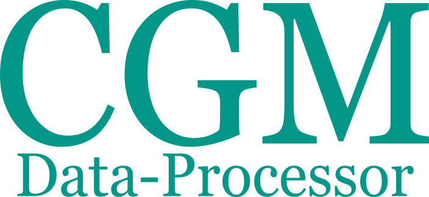
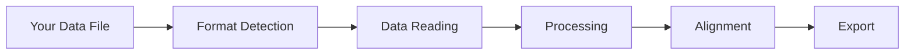

# 
[](https://opensource.org/licenses/MIT)
[](https://www.repostatus.org/#active)


A powerful Python tool for processing and analyzing Continuous Glucose Monitoring (CGM) data from various diabetes devices. This tool automatically detects file formats, processes data, and aligns multiple data streams for comprehensive diabetes data analysis.

## Features

- **Automatic Format Detection**: Intelligently identifies data formats from different CGM devices
- **Multi-Device Support**: 
    - Dexcom CGM systems
    - Libre CGM systems
    - XDrip+ data
- **Flexible Data Processing**:
    - CGM readings
    - Insulin doses
    - Carbohydrate intake
    - Notes and events
- **Smart Data Alignment**: Automatically aligns different data streams by timestamp
- **Extensible Architecture**: Easy to add support for new devices and data formats

## Quick Start

### Installation

```bash
pip install cgm-data-processor
```

### Basic Usage

Process a single diabetes device data file:

```bash
cgm-process path/to/your/file.csv
```

Enable detailed analysis with debug mode:

```bash
cgm-process path/to/your/file.csv --debug
```

## Processing Pipeline

1. **Format Detection**: Automatically identifies the source device and data format
2. **Data Reading**: Extracts data using format-specific readers
3. **Data Processing**: Processes and validates data streams
4. **Data Alignment**: Aligns multiple data streams by timestamp
5. **Analysis**: Provides detailed data analysis in debug mode




## Project Status

The project is under active development. Current focus areas:


- Implementation of data exporters
- Enhanced data visualization
- Additional device format support

## Documentation

- [Getting Started Guide](getting-started/index.md)
- [Supported Formats](user-guide/supported-formats/index.md)
- [API Reference](api/index.md)
- [Development Guide](development/index.md)


