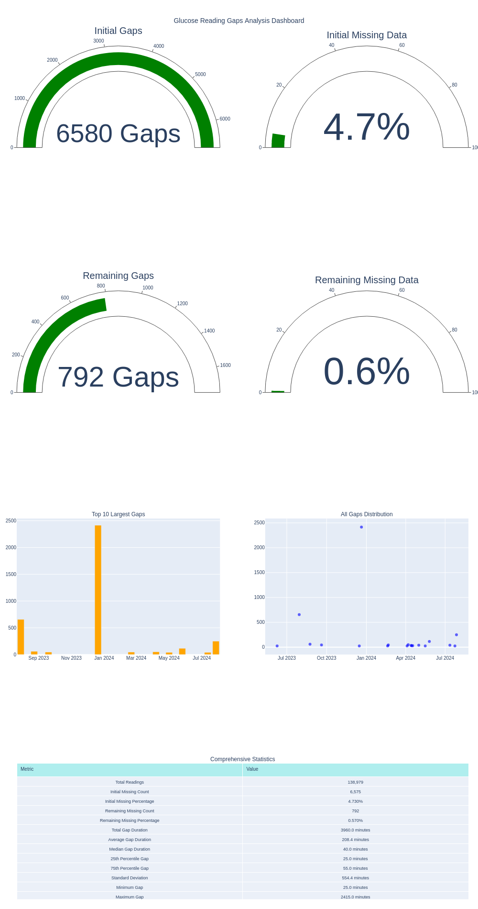

# CGM Data Processor

[](https://opensource.org/licenses/MIT)
[](https://www.repostatus.org/#active)

A Python tool for standardizing and analyzing Continuous Glucose Monitoring (CGM) data from various sources. Currently supports XDrip+ SQLite backups with plans to expand to other CGM platforms.



## Key Features

- **Standardized Data**: Consistent 5-minute interval format for all CGM data
- **Comprehensive Processing**:
  - Robust data cleaning and validation
  - Support for both mg/dL and mmol/L units
  - Intelligent handling of missing data with configurable interpolation
  - Integration of glucose readings with insulin and carbohydrate records
- **Advanced Analysis**:
  - Comprehensive gap analysis and quality metrics
  - Interactive quality assessment dashboards
  - Smart classification of insulin (basal/bolus)
- **Flexible Export**: Multiple CSV formats for further analysis

## Quick Start

```python
from preprocessing.loading import XDrip
from preprocessing.cleaning import clean_glucose, clean_classify_insulin, clean_classify_carbs
from preprocessing.alignment import align_diabetes_data

# Load data from XDrip+ backup
data = XDrip('path_to_backup.sqlite')

# Process individual components
glucose_df = clean_glucose(data.load_glucose_df())
insulin_df = clean_classify_insulin(data.load_treatment_df())
carb_df = clean_classify_carbs(data.load_treatment_df())

# Create aligned dataset
aligned_df = align_diabetes_data(glucose_df, carb_df, insulin_df)
```

## Installation

```bash
# For users (once published to PyPI)
pip install [package-name]

# For developers
git clone https://github.com/Warren8824/cgm-data-processor.git
cd cgm-data-processor
pip install -e .
```

## Data Processing Pipeline

1. **Data Loading**
    - Extract data from XDrip+ SQLite backup
    - Support for additional platforms planned

2. **Cleaning & Validation**
    - Glucose readings validated and converted to standard units
    - Intelligent insulin classification (basal/bolus)
    - Carbohydrate entry validation

3. **Timeline Alignment**
    - All data aligned to 5-minute intervals
    - Smart handling of missing data
    - Integration of multiple data types

4. **Quality Assessment**
    - Comprehensive gap analysis
    - Data quality metrics
    - Interactive dashboards

5. **Export Options**
    - `complete.csv`: Aligned dataset with all measurements
    - `glucose_reading.csv`: Processed glucose readings
    - `carbs.csv`: Validated carbohydrate records
    - `insulin.csv`: Classified insulin records

## Documentation Structure

- [**Getting Started**](getting-started.md)
    - Basic setup and installation
    - First steps with the tool
    - Quick usage examples

- [**User Guide**](user-guide/index.md)
    - Detailed usage instructions
    - Configuration options
    - Best practices

- [**API Reference**](api/reference.md)
    - Complete API documentation
    - Module references
    - Code examples

- [**Examples**](user-guide/preprocessing/loading.md)
    - Jupyter notebook tutorials
    - Real-world use cases
    - Advanced features

## Project Status & Roadmap

### Completed
- [x] Initial setup for XDrip+ SQLite backups
- [x] Basic data processing pipeline
- [x] Gap analysis functionality
- [x] Interactive dashboards

### In Progress
- [ ] Setup test suite
- [ ] Support for additional CGM platforms
- [ ] Advanced meal response analysis
- [ ] Machine learning integration
- [ ] Web interface
- [ ] API development

## Contributing

We welcome contributions! See our [Contributing Guide](development/contributing.md) for:

- Development setup
- Code style guidelines
- Pull request process
- Bug reporting guidelines

## Support & Community

- 📚 [Documentation](https://cgm-data-processor.readthedocs.io/)
- 🐛 [Issue Tracker](https://github.com/Warren8824/cgm-data-processor/issues)
- 💡 [Discussions](https://github.com/Warren8824/cgm-data-processor/discussions)

## License

This project is licensed under the MIT License - see the [LICENSE](about/license.md) file for details.

## Acknowledgments

- XDrip+ development team for their excellent CGM application
- All contributors to this project
- The diabetes tech community for their support and feedback