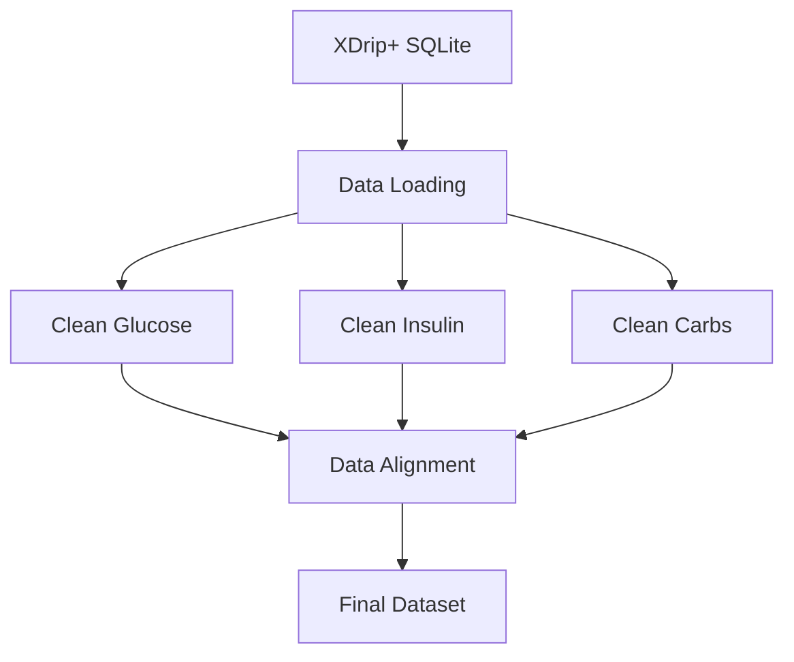

# Data Processing Pipeline

This guide explains how CGM Data Processor transforms raw XDrip+ data into analysis-ready datasets. The pipeline consists of three main stages: data loading, data cleaning/processing, and data alignment.

## Pipeline Overview



## 1. Data Loading

The first stage uses the `XDrip` class to load data from an XDrip+ SQLite backup:

```python
from preprocessing.loading import XDrip

# Initialize loader
data = XDrip('path_to_backup.sqlite')

# Load separate components
glucose_df = data.load_glucose_df()
treatment_df = data.load_treatment_df()
```

The loader:

- Converts millisecond timestamps to datetime
- Sets timestamps as index
- Removes duplicate timestamps
- Separates glucose readings and treatments

## 2. Data Cleaning and Processing

### Glucose Data Processing
```python
from preprocessing.cleaning import clean_glucose

glucose_df = clean_glucose(glucose_df, interpolation_limit=4)
```

The glucose cleaning process:

- Rounds timestamps to 5-minute intervals
- Creates a complete timeline with all 5-minute intervals
- Interpolates missing values (up to 20 minutes by default)
- Converts units and provides both mg/dL and mmol/L
- Tracks originally missing values
- Clips values to valid ranges (39.64-360.36 mg/dL or 2.2-20.0 mmol/L)

Key Parameters:
- `interpolation_limit`: Maximum gaps to interpolate (default=4, representing 20 minutes)

### Insulin Processing
```python
from preprocessing.cleaning import clean_classify_insulin

insulin_df = clean_classify_insulin(treatment_df, bolus_limit=8, max_limit=15)
```

The insulin processing:

- Classifies insulin into bolus or basal types
- Uses JSON labels when available
- Applies heuristic classification for unlabeled doses
- Removes invalid or extreme doses
- Tracks whether doses were explicitly labeled

Key Parameters:

- `bolus_limit`: Maximum units to classify as bolus (default=8.0)
- `max_limit`: Maximum valid insulin dose (default=15.0)

### Carbohydrate Processing
```python
from preprocessing.cleaning import clean_classify_carbs

carb_df = clean_classify_carbs(treatment_df)
```

The carbohydrate processing:

- Filters for significant meals (≥1g carbs)
- Removes duplicate timestamps
- Simplifies to essential data

## 3. Data Alignment

The final stage aligns all processed data to the glucose timeline:

```python
from core.alignment import align_diabetes_data

aligned_df = align_diabetes_data(glucose_df, carb_df, insulin_df)
```

The alignment process:

- Uses the glucose DataFrame's 5-minute interval index as the base timeline
- Rounds carb and insulin timestamps to 5-minute intervals
- Sums multiple treatments within the same 5-minute window
- Fills missing treatment values with 0
- Preserves glucose NaN values where data is missing
- Maintains insulin labeling information

## Output Formats

The pipeline can generate four different dataset formats depending on your needs:

### 1. Complete Aligned Dataset
A single DataFrame containing all data aligned to 5-minute intervals:

```python
[
    'mg_dl',           # Glucose in mg/dL
    'mmol_l',          # Glucose in mmol/L
    'missing',         # Boolean flag for missing glucose values
    'carbs',           # Carbohydrates in grams
    'bolus',           # Bolus insulin in units
    'basal',           # Basal insulin in units
    'labeled_insulin'  # Boolean flag for labeled insulin
]
```

### 2. Separate Processed Datasets

For analyses requiring precise timing of individual components, you can use three separate datasets:

#### Processed CGM Data

```python
[
    'mg_dl',           # Glucose in mg/dL
    'mmol_l',          # Glucose in mmol/L
    'missing'          # Boolean flag for missing values
]
```

#### Processed Insulin Data

```python
[
    'bolus',           # Bolus insulin in units
    'basal',           # Basal insulin in units
    'labeled_insulin'  # Boolean flag for labeled insulin
]
```

#### Processed Carbohydrate Data

```python
[
    'carbs'            # Carbohydrates in grams
]
```

### Export Options

You can export any of these datasets to CSV format:

```python
# Export complete aligned dataset
aligned_df.to_csv("complete.csv")

# Export separate components
glucose_df.to_csv("glucose_readings.csv")
insulin_df.to_csv("insulin.csv")
carb_df.to_csv("carbs.csv")
```

Choose the format that best suits your analysis needs:

- Use the complete aligned dataset for machine learning or unified analysis
- Use separate datasets when precise timing of individual components is crucial
- Export to CSV for use in other analysis tools or platforms

## Best Practices

1. **Data Quality**
    - Always check your XDrip+ backup file is recent and complete
    - Monitor the number of interpolated values
    - Review insulin classification, especially for unlabeled doses
    - Verify carbohydrate entries are reasonable

2. **Configuration**
    - Adjust interpolation_limit based on your CGM's reliability
    - Review bolus_limit if your typical doses differ from defaults
    - Consider your CGM's specific value ranges

3. **Processing Large Datasets**
    - The pipeline handles data chronologically
    - All operations maintain timestamp integrity
    - Memory usage scales with dataset size

## Common Issues and Solutions

1. **Missing Data**
    - Gaps longer than 20 minutes remain as NaN
    - Check 'missing' column to identify original gaps
    - Consider adjusting interpolation_limit for your needs

2. **Insulin Classification**
    - Review labeled_insulin column to identify heuristic classifications
    - Adjust bolus_limit based on your typical dosing
    - Large doses (>max_limit) are dropped if unlabeled

3. **Timestamp Alignment**
    - All data is aligned to 5-minute intervals
    - Multiple treatments in the same interval are summed
    - Original timestamps are rounded to nearest 5 minutes

## Next Steps

- Check out the [Gap Analysis](gap_analysis.md) guide
- Review the [API Reference](../../api/index.md) for detailed function documentation
- Explore example notebooks for practical applications