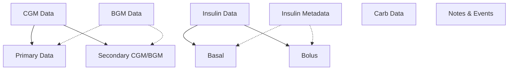

# Understanding Data Types

The CGM Data Processor handles four main types of diabetes data, each with its own characteristics and processing requirements. Understanding these data types is key to effectively using the system.

## Core Data Types



## Data Type Characteristics

=== "CGM Data"
    - 5-minute reading intervals (typical)
    - mg/dL or mmol/L units
    - Primary and secondary readings
    - Gap handling and interpolation
    - Quality indicators

=== "Insulin Data"
    - Timestamped doses
    - Basal/bolus classification
    - Units measurement
    - Optional metadata
    - Brand information

=== "Carb Data"
    - Timestamped records
    - Gram measurements
    - Meal markers
    - Value validation
    - Duplicate handling

=== "Notes Data"
    - Text-based records
    - Event timestamps
    - Multiple categories
    - Free-form content
    - Optional context

## Unit System

!!! info "Supported Units"
    The system supports these units for different data types:

    | Data Type | Primary Unit | Secondary Unit |
    |-----------|--------------|----------------|
    | CGM/BGM   | mg/dL        | mmol/L         |
    | Insulin   | Units        | -              |
    | Carbs     | Grams        | -              |
    | Notes     | N/A          | -              |

## Primary vs Secondary Data

Many data types support primary and secondary records:

```python
# Example column configuration
glucose_columns = [
    ColumnMapping(
        source_name="calculated_value",
        data_type=DataType.CGM,
        unit=Unit.MGDL,
        is_primary=True  # Primary column
    ),
    ColumnMapping(
        source_name="raw_value",
        data_type=DataType.CGM,
        unit=Unit.MGDL,
        is_primary=False  # Secondary column
    )
    ColumnMapping(
        source_name="age_adjusted_value",
        data_type=DataType.CGM,
        unit=Unit.MGDL,
        is_primary=False  # Another Secondary column
    )
]
```

### When to Use Each

1. **Primary Data**
    - Main analysis values
    - Required for processing
    - Used for alignment
    - Official readings

2. **Secondary Data**
    - Raw sensor data
    - Backup readings
    - Alternative calculations
    - Quality checks

## Data Type Processing

### Processing Flow

1. **Initial Processing**
   ```python
   processor = DataProcessor()
   results = processor.process_tables(table_data, table_configs)
   
   # Access specific data types
   cgm_data = results.get(DataType.CGM)
   insulin_data = results.get(DataType.INSULIN)
   carbs_data = results.get(DataType.CARBS)
   notes_data = results.get(DataType.NOTES)
   ```

2. **Data Alignment**
   ```python
   aligner = Aligner()
   aligned_data = aligner.align(
       processed_data=results,
       freq="5min"  # Common timeline frequency
   )
   ```

### Type-Specific Features

=== "CGM Processing"
    ```python
    # CGM-specific features
    cgm_df = cgm_data.dataframe
    
    # Access both unit versions
    mgdl_values = cgm_df['cgm_primary']
    mmol_values = cgm_df['cgm_primary_mmol']
    
    # Check data quality
    missing_data = cgm_df['missing']
    gaps = missing_data.sum()
    ```

=== "Insulin Processing"
    ```python
    # Insulin-specific features
    insulin_df = insulin_data.dataframe
    
    # Access dose types
    basal_doses = insulin_df[insulin_df['is_basal']]
    bolus_doses = insulin_df[insulin_df['is_bolus']]
    
    # Get insulin types
    insulin_types = insulin_df['type'].unique()
    ```

=== "Carbs Processing"
    ```python
    # Carbs-specific features
    carbs_df = carbs_data.dataframe
    
    # Get daily totals
    daily_carbs = carbs_df.groupby(
        carbs_df.index.date
    )['carbs_primary'].sum()
    ```

=== "Notes Processing"
    ```python
    # Notes-specific features
    notes_df = notes_data.dataframe
    
    # Get all notes
    valid_notes = notes_df['notes_primary'].dropna()
    
    # Find specific types of notes
    exercise_notes = valid_notes[
        valid_notes.str.contains('exercise', case=False)
    ]
    ```

## Common Use Cases

### 1. Data Analysis

```python
# Basic statistics
for data_type, data in results.items():
    df = data.dataframe
    print(f"\n{data_type.name} Analysis:")
    print(f"Total Records: {len(df)}")
    print(f"Time Range: {df.index.min()} to {df.index.max()}")
    print("Notes:", "\n  ".join(data.processing_notes))
```

### 2. Quality Checking

```python
# Check data completeness
def check_completeness(results):
    for data_type, data in results.items():
        df = data.dataframe
        total_time = df.index.max() - df.index.min()
        records_per_day = len(df) / total_time.days
        print(f"{data_type.name}: {records_per_day:.1f} records/day")
```

### 3. Combined Analysis

```python
# Analyze insulin and carbs together
def analyze_treatments(results):
    insulin_data = results.get(DataType.INSULIN)
    carbs_data = results.get(DataType.CARBS)
    
    if insulin_data and carbs_data:
        # Align to same timeline
        aligner = Aligner()
        aligned = aligner.align(results)
        
        # Now you can analyze relationships
        df = aligned.dataframe
        return df[['bolus_dose', 'carbs_primary']].corr()
```

## Next Steps

Learn more about specific data types:

1. [CGM Data](cgm.md) - Continuous glucose monitoring data
2. [Insulin Data](insulin.md) - Insulin doses and metadata
3. [Carbohydrate Data](carbs.md) - Carbohydrate intake records
4. [Notes & Events](notes.md) - Text-based records and events

## Best Practices

!!! tip "Working with Data Types"
    1. **Data Quality**
         - Validate unit settings
         - Check for missing data
         - Monitor data frequency
         - Verify timestamps

    2. **Processing**
         - Use appropriate primary columns
         - Handle missing values consistently
         - Validate processed results
         - Check processing notes

    3. **Analysis**
         - Align related data types
         - Consider time zones
         - Handle duplicate records
         - Document processing steps