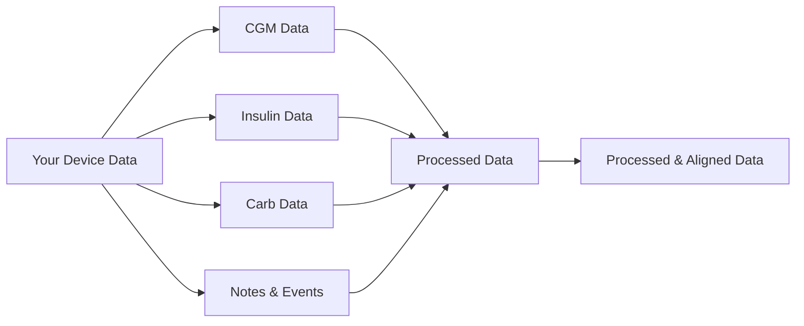

# User Guide Overview

The CGM Data Processor is a powerful tool designed to help process and analyze diabetes device data. This guide will help you understand how to use the system effectively for your data analysis needs.

## What Can You Do?

!!! success "Key Capabilities"
    - Process data from multiple diabetes devices (Dexcom, Libre, XDrip+)
    - Combine data streams (CGM, insulin, carbs, notes)
    - Align and synchronize different data types
    - Convert between units (mg/dL ↔ mmol/L)
    - Validate and clean your data

## Supported Data Types



### Types of Data You Can Process

=== "CGM Data"
    - Continuous glucose readings
    - Automated gap filling
    - Unit conversion
    - Data quality tracking

=== "Insulin Data"
    - Basal and bolus doses
    - Insulin types
    - Dose timing
    - Treatment metadata

=== "Carb Data"
    - Carbohydrate intake records
    - Meal timing
    - Value validation
    - Duplicate handling

=== "Notes & Events"
    - Treatment notes
    - Exercise records
    - General observations
    - Event timing

## Supported Devices

The system currently supports these devices:

!!! info "Device Support"
    1. **Dexcom Systems**
        - Export formats: CSV, XML
        - Data types: CGM, events
        - Unit support: mg/dL, mmol/L

    2. **Libre Systems**
        - Export formats: CSV
        - Data types: CGM, notes
        - Unit support: mg/dL, mmol/L

    3. **XDrip+**
        - Export formats: SQLite backup
        - Data types: All supported types
        - Comprehensive metadata support

## Getting Started

### 1. Prepare Your Data

Before processing, ensure you have:

- Exported data from your device
- Identified the file format
- Checked the file's completeness

### 2. Process Your Data

Basic processing flow:

```python
from pathlib import Path
from src.file_parser.format_registry import FormatRegistry
from src.file_parser.format_detector import FormatDetector
from src.processors import DataProcessor
from src.readers import BaseReader

# Initialize components
registry = FormatRegistry()
detector = FormatDetector(registry)
processor = DataProcessor()

# Process a file
file_path = Path("my_diabetes_data.csv")
detected_format, error, results = detector.detect_format(file_path)

if format:
    # Process the data
    reader = BaseReader.get_reader_for_format(detected_format, file_path)
    with reader:
        table_data = reader.read_all_tables()
        if table_data:
            # Process the tables
            processed_results = processor.process_tables(
                table_data=table_data,
                detected_format= detected_format
            )
            
            # Now you have processed data by type
            print("\nProcessed Data Types:")
            for data_type, data in processed_results.items():
                print(f"- {data_type.name}: {data.dataframe.shape} records")
```

### 3. Access Your Results

The processed data includes:

- Aligned time series data
- Processing notes and statistics
- Data quality indicators
- Unit information

## Common Workflows

### Working with CGM Data

1. **Load and Process**
   ```python
   processor = DataProcessor()
   results = processor.process_tables(table_data, table_configs)
   cgm_data = results.get(DataType.CGM)
   ```

2. **Check Data Quality**
   ```python
   # Access CGM data quality indicators
   missing_data = cgm_data.dataframe['missing']
   gaps = missing_data.sum()
   print(f"Found {gaps} gaps in CGM data")
   ```

### Combining Data Types

1. **Align Different Data Types**
   ```python
   from src.core.aligner import Aligner

   # Align all data to CGM timeline
   aligner = Aligner()
   aligned_data = aligner.align(results)
   ```

2. **Access Combined Data**
   ```python
   # Get aligned DataFrame
   combined_df = aligned_data.dataframe
   print(f"Time range: {aligned_data.start_time} to {aligned_data.end_time}")
   ```

## Next Steps

Learn more about:

1. [Understanding Data Types](data-types/index.md)
    - Detailed information about each data type
    - Processing capabilities
    - Data requirements

2. [Supported Devices](devices/index.md)
    - Device-specific information
    - Export formats
    - Data limitations

3. [Data Processing](processing/index.md)
    - Processing options
    - Data alignment
    - Error handling

## Best Practices

!!! tip "Tips for Success"
    1. **Data Quality**
        - Export complete datasets
        - Check for timestamp consistency
        - Validate unit settings

    2. **Processing**
        - Process related data together
        - Check processing notes
        - Handle errors appropriately

    3. **Analysis**
        - Verify aligned data
        - Check for gaps
        - Monitor data quality

## Getting Help

If you encounter issues:

1. Check the [Error Handling](processing/errors.md) guide
2. Review processing notes in your results
3. Verify your input data
4. Check device-specific requirements

## Next Section

Continue to [Understanding Data Types](data-types/index.md) to learn about the different types of data you can process and how they work together.